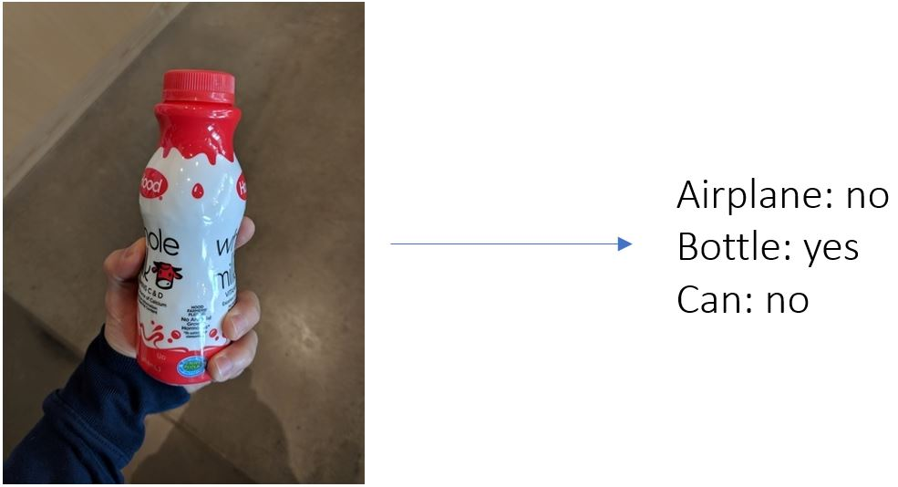
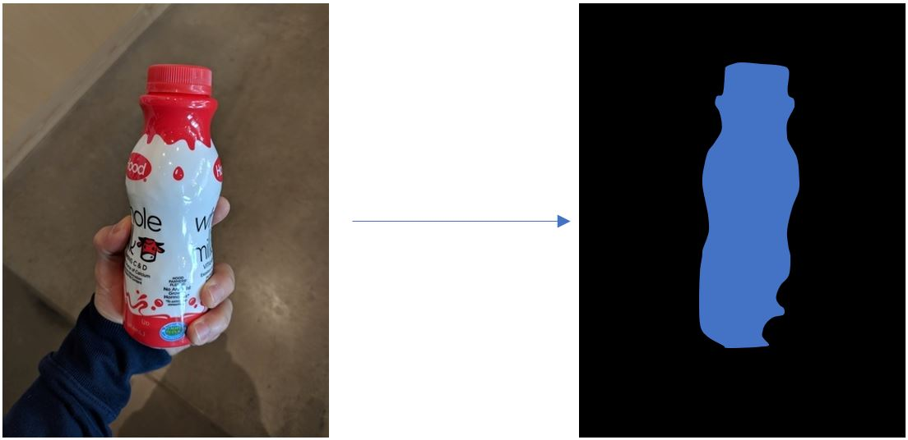

# Computer Vision

This repository provides implementations and best practice guidelines for building Computer Vision systems. All examples are given as Jupyter notebooks, and use PyTorch as Deep Learning library.

## Build Status

| Build Type | Branch | Status |  | Branch | Status |
| --- | --- | --- | --- | --- | --- |
| **Linux GPU** |  master |   | | staging |  |
| **Linux CPU** | master | | | staging | |
| **Windows GPU** | master |  | | staging | |
| **Windows CPU** | master |  | | staging | |

## Overview

The goal of this repository is to help speed up development of Computer Vision applications. Rather than implementing custom approaches, the focus is on providing examples and links to existing state-of-the-art libraries. In addition, having worked in this space for many years, we aim to answer common questions, point out often observed pitfalls, and show how to use the cloud for deployment and training.

Currently the main investment/priority is around image classification and to a lesser extend image segmentation. We are also actively working on providing a basic (but often sufficiently accurate) example for image similarity. Object detection is scheduled to start once image classification is completed. See the [projects](https://github.com/Microsoft/ComputerVision/projects) and [milestones](https://github.com/Microsoft/ComputerVision/milestones) pages in this repository for more details.

## Getting Started

Instructions on how to get started, as well as our example notebooks and discussions are provided in the [classification](classification/README.md) subfolder.

Note that for certain Computer Vision problems, ready-made or easily customizable solutions exist which do not require any custom coding or machine learning expertise. We strongly recommend evaluating if these can sufficiently solve your problem. If these solutions are not applicable, or the accuracy of these solutions is not sufficient, then resorting to more complex and time-consuming custom approaches may be necessary.

The following Microsoft services offer simple solutions to address common Computer Vision tasks:

- [Cognitive Services](https://azure.microsoft.com/en-us/services/cognitive-services/directory/vision/)
provides pre-trained REST APIs which can be called for image classification, face recognition, OCR, video analytics, and much more. These APIs are easy to use and work out of the box (no training required), however customization is limited. See the various demos available for each domain to get a feel for the functionality (e.g., [computer vision](https://azure.microsoft.com/en-us/services/cognitive-services/computer-vision/), [speech to text](https://azure.microsoft.com/en-us/services/cognitive-services/speech-to-text/) ).

- [Custom Vision Service](https://azure.microsoft.com/en-us/services/cognitive-services/custom-vision-service/)
is a SaaS service to train and deploy a model as a REST API given a user-provided training set. All steps from image upload, annotation, to model deployment can be performed using either the UI or a Python SDK. Training image classification or object detection models are supported using only minimal machine learning knowledge. The Custom Vision Service offers more flexibility than using the pre-trained Cognitive Services APIs, but requires the user to bring and annotate their own data.

- [Azure Machine Learning service (AzureML)](https://azure.microsoft.com/en-us/services/machine-learning-service/)
is a more general machine learning service that helps users accelerate training and deploying machine learning models. While not specific for Computer Vision workloads, the AzureML Python SDK can be used for scalable and reliable training and deploying machine learning solutions to the cloud. While AzureML offers significantly more flexibility than other options, it also requires significantly more machine learning and programming knowledge.

- [Azure AI Reference architectures](https://docs.microsoft.com/en-us/azure/architecture/reference-architectures/ai/training-python-models) While not Computer Vision specific, these reference architectures cover general Machine Learning aspects such as model deployment or batch scoring.

## Computer Vision Domains

Most applications in Computer Vision (CV) fall into one of these 4 categories:

- **Image classification**: Given an input image, predict what object is present in the image. This is typically the easiest CV problem to solve, however classification requires objects to be reasonably large in the image.

&nbsp;&nbsp;&nbsp;&nbsp;&nbsp;&nbsp;   

- **Object Detection**: Given an input image, identify and locate which objects are present (using rectangular coordinates). Object detection can find small objects in an image. Compared to image classification, both model training and manually annotating images is more time-consuming in object detection, since both the label and location are required.

&nbsp;&nbsp;&nbsp;&nbsp;&nbsp;&nbsp; 

- **Image Similarity** Given an input image, find all similar objects in images from a reference dataset. Here, rather than predicting a label and/or rectangle, the task is to sort through a reference dataset to find objects similar to that found in the query image.

&nbsp;&nbsp;&nbsp;&nbsp;&nbsp;&nbsp; 

- **Image Segmentation** Given an input image, assign a label to every pixel (e.g., background, bottle, hand, sky, etc.). In practice, this problem is less common in industry, in large part due to time required to label the ground truth segmentation required in order to train a solution.

&nbsp;&nbsp;&nbsp;&nbsp;&nbsp;&nbsp; 

## Contributing
This project welcomes contributions and suggestions. Please see our [contribution guidelines](CONTRIBUTING.md).
