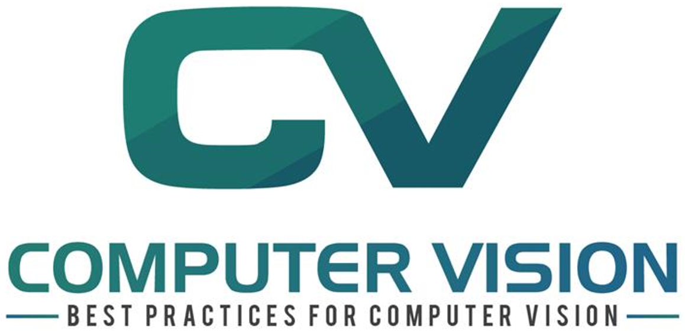

# Computer Vision

In recent years, we've see an extra-ordinary growth in Computer Vision, with applications in face recognition, image understanding, search, drones, mapping, semi-autonomous and autonomous vehicles. A key part to many of these applications are visual recognition tasks such as image classification, object detection and image similarity. 

This repository provides examples and best practice guidelines for building computer vision systems. The goal of this repository is to build a comprehensive set of tools and examples that leverage recent advances in Computer Vision algorithms, neural architectures, and operationalizing such systems. Rather than creating implementions from scratch, we draw from existing state-of-the-art libraries and build additional utility around loading image data, optimizing and evaluating models, and scaling up to the cloud. In addition, having worked in this space for many years, we aim to answer common questions, point out frequently observed pitfalls, and show how to use the cloud for training and deployment.

We hope that these examples and utilities can significantly reduce the “time to market” by simplifying the experience from defining the business problem to development of solution by orders of magnitude. In addition, the example notebooks would serve as guidelines and showcase best practices and usage of the tools in a wide variety of languages.

These examples are provided as [Jupyter notebooks](scenarios) and common [utility functions](utils_cv). All examples use PyTorch as the underlying deep learning library.

## Target Audience

Our target audience for this repository includes data scientists and machine learning engineers with varying levels of Computer Vision knowledge as our content is source-only and targets custom machine learning modelling. The utilities and examples provided are intended to be solution accelerators for real-world vision problems. 

## Get Started

To get started, navigate to the [Setup Guide](SETUP.md), which lists
instructions on how to setup the compute environment and dependencies needed to run the
notebooks in this repo. Once your environment is setup, navigate to the
[Scenarios](scenarios) folder and start exploring the notebooks.

## Scenarios

The following is a summary of commonly used Computer Vision scenarios that are covered in this repository. For each of the main scenarios ("base"), we provide the tools to effectively build your own model. This includes simple tasks such as fine-tuning your own model on your own data, to more complex tasks such as hard-negative mining and even model deployment.

| Scenario | Support     | Description |
| -------- | ----------- | ----------- |
| [Classification](scenarios/classification) | Base | Image Classification is a supervised machine learning technique that allows you to learn and predict the category of a given image. |
| [Similarity](scenarios/similarity)  | Base | Image Similarity is a way to compute a similarity score given a pair of images. Given an image, it allows you to identify the most similar image in a given dataset.  |
| [Detection](scenarios/detection) | Base | Object Detection is a supervised machine learning technique that allows you to detect the bounding box of an object within an image. |
| [Action recognition](contrib/action_recognition) | Contrib | Action recognition to identify in video/webcam footage what actions are performed (e.g. "running", "opening a bottle") and at what respective start/end times.|
| [Crowd counting](contrib/crowd_counting) | Contrib | Counting the number of people in low-crowd-density (e.g. less than 10 people) and high-crowd-density (e.g. thousands of people) scenarios.|

We separate the supported CV scenarios into two locations: (i) **base**: code and notebooks within the "utils_cs" and "scenarios" folders which follow strict coding guidelines, are well tested and maintained; (ii) **contrib**: code and other assets within the "contrib" folder, mainly covering less common CV scenarios using bleeding edge state-of-the-art approaches. Code in "contrib" is not regularly tested or maintained.

## Computer Vision on Azure

Note that for certain computer vision problems, you may not need to build your own models. Instead, pre-built or easily customizable solutions exist which do not require any custom coding or machine learning expertise. We strongly recommend evaluating if these can sufficiently solve your problem. If these solutions are not applicable, or the accuracy of these solutions is not sufficient, then resorting to more complex and time-consuming custom approaches may be necessary.

The following Microsoft services offer simple solutions to address common computer vision tasks:

- [Vision Services](https://docs.microsoft.com/azure/cognitive-services/computer-vision/?WT.mc_id=computervision-github-azureai)
are a set of pre-trained REST APIs which can be called for image tagging, face recognition, OCR, video analytics, and more. These APIs work out of the box and require minimal expertise in machine learning, but have limited customization capabilities. See the various demos available to get a feel for the functionality (e.g. [Computer Vision](https://azure.microsoft.com/en-us/services/cognitive-services/computer-vision/#analyze)).

- [Custom Vision](https://docs.microsoft.com/azure/cognitive-services/custom-vision-service/?WT.mc_id=computervision-github-azureai)
is a SaaS service to train and deploy a model as a REST API given a user-provided training set. All steps including image upload, annotation, and model deployment can be performed using either the UI or a Python SDK. Training image classification or object detection models can be achieved with minimal machine learning expertise. The Custom Vision offers more flexibility than using the pre-trained cognitive services APIs, but requires the user to bring and annotate their own data.

If you need to train your own model, the following services and links provide additional information that is likely useful.

- [Azure Machine Learning service (AzureML)](https://docs.microsoft.com/azure/machine-learning/?WT.mc_id=computervision-github-azureai)
is a service that helps users accelerate the training and deploying of machine learning models. While not specific for computer vision workloads, the AzureML Python SDK can be used for scalable and reliable training and deployment of machine learning solutions to the cloud. We leverage Azure Machine Learning in several of the notebooks within this repository (e.g. [deployment to Azure Kubernetes Service](classification/notebooks/22_deployment_on_azure_kubernetes_service.ipynb))

- [Azure AI Reference architectures](https://docs.microsoft.com/en-us/azure/architecture/reference-architectures/ai/training-python-models/?WT.mc_id=computervision-github-azureai)
provide a set of examples (backed by code) of how to build common AI-oriented workloads that leverage multiple cloud components. While not computer vision specific, these reference architectures cover several machine learning workloads such as model deployment or batch scoring.

## Build Status

### VM Testing

| Build Type | Branch | Status |  | Branch | Status |
| --- | --- | --- | --- | --- | --- |
| **Windows GPU** | master |  | | staging | |
| **Windows CPU** | master |  | | staging | |

### AzureML Testing

| Build Type | Branch | Status |  | Branch | Status |
| --- | --- | --- | --- | --- | --- |
| **Linxu GPU** | master |  | | staging | |
| **Linux CPU** | master |  | | staging | |
| **Notebook unit GPU** | master |  | | staging |  |

## Contributing
This project welcomes contributions and suggestions. Please see our [contribution guidelines](CONTRIBUTING.md).

