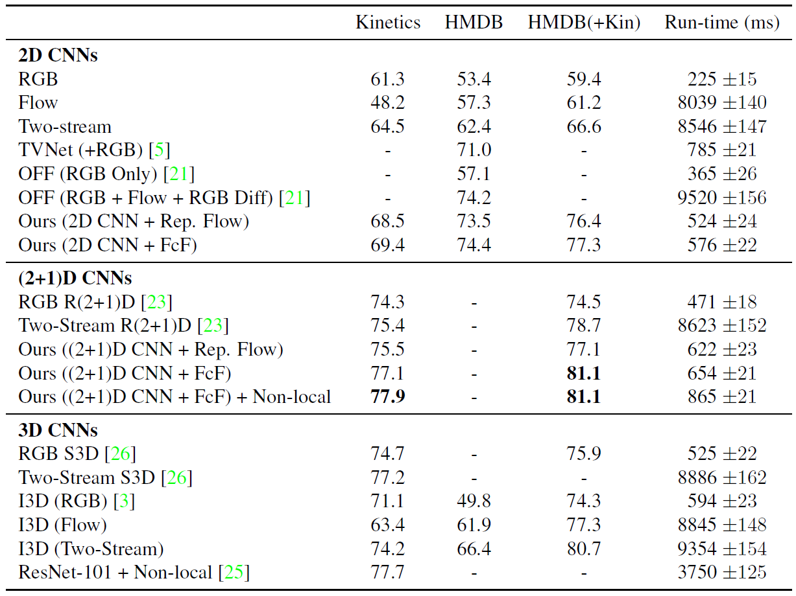

# Action Recognition

Action recognition (also often called activity recognition) consists of classifying different actions from a sequence
of frames in videos.

This directory contains example projects for building video-based action recognition systems.
Our goal is to enable users to easily and quickly train high-accuracy action recognition models with fast inference speed.

Currently, we provide two state of the art model implementations, Two-Stream [Inflated 3D ConvNet, I3D](https://arxiv.org/pdf/1705.07750.pdf)
and RGB [ResNets with (2+1)D convolutions, R(2+1)D](https://arxiv.org/abs/1711.11248)
along with their example notebooks for fine-tuning on [HMDB-51 dataset](http://serre-lab.clps.brown.edu/resource/hmdb-a-large-human-motion-database/).
More details about the models can be found in [Models](#models) section below.

Each project describes independent SETUP process with a separate conda environment under its directory.
  
We recommend to use R(2+1)D implementation for its competitive accuracy (see below [comparison table](#comparison)) with much faster inference speed as well as less-dependencies on other packages.
We also provide the Webcam stream notebook for R(2+1)D to test real-time inference. 
  
Nevertheless, I3D implementation gives a good example of utilizing the two-stream approach for action recognition so that those who want to benchmark and/or tryout different approaches can use.

## Projects

| Directory |  Description |
| -------- |  ----------- |
| [r2p1d](r2p1d)  | Scripts for fine-tuning a pre-trained R(2+1)D model on HMDB-51 dataset 
| [i3d](i3d)  | Scripts for fine-tuning a pre-trained I3D model on HMDB-51 dataset 
| [video_annotation](video_annotation)  | Instructions and helper functions to annotate the start and end position of actions in video footage|

### Models

The R(2+1)D model was presented in \[2\] where the authors pretrained the model on [Kinetics400](https://arxiv.org/abs/1705.06950) and produced decent performance close to state of the art on the HMDB-51 dataset.
In [r2p1d](r2p1d) we demonstrate fine-tuning R(2+1)D model [pretrained on 65 million videos](https://arxiv.org/abs/1905.00561).
We use the pretrained weight from [https://github.com/moabitcoin/ig65m-pytorch](https://github.com/moabitcoin/ig65m-pytorch).

In [i3d](i3d) we show how to fine-tune I3D model. This model was introduced in \[[1](https://arxiv.org/pdf/1705.07750.pdf)\]
and achieved state of the art in action classification on the HMDB-51 and UCF-101 datasets.
Here, we use models pre-trained on Kinetics from [https://github.com/piergiaj/pytorch-i3d](https://github.com/piergiaj/pytorch-i3d).

The following table shows the comparison between the reported performance in the original papers and our results on HMDB-51 dataset.
Please note that the accuracies from the papers are averages over 3 splits, while ours are based on the split 1 only.
Also, the original R(2+1)D paper used the model pretrained on Kinetics400 but we used the one pretrained on the 65 million videos which explains the higher accuracy (74.5% vs 79.8%).

*Comparison on HMDB-51*

| Model | Reported in the paper | Our results |
| ------- | -------| ------- |
| R(2+1)D RGB | 74.5 | 79.8 |
| I3D RGB | 74.8 | 73.7 |
| I3D Optical flow | 77.1 | 77.5 |
| I3D Two-Stream | 80.7 | 81.2 |

### Annotation
In order to train an action recognition model for a specific task, annotated training data from the relevant domain is needed. In [video_annotation](video_annotation), we provide tips and examples for how to use a best-in-class video annotation tool ([VGG Image Annotator](http://www.robots.ox.ac.uk/~vgg/software/via/)) to label the start and end positions of actions in videos.

## State of the art

In the tables below, we list datasets which are commonly used and also give an overview of the state-of-the-art. Note that the information below is reasonably exhaustive and should cover most major publications until 2018. Expect however some level of incompleteness and slight incorrectness (e.g. publication year being off by plus/minus 1 year due) since the tables below were mainly compiled to give a high-level picture of where the field is and how it evolved over the last years.

Recommended reading:
- As introduction to action recognition the blog [Deep Learning for Videos: A 2018 Guide to Action Recognition](http://blog.qure.ai/notes/deep-learning-for-videos-action-recognition-review).
- [ActionRecognition.net](http://actionrecognition.net/files/dset.php) for the latest state-of-the-art accuracies on popular research benchmark datasets.
- All papers highlighted in yellow in the publications table below.

*Popular datasets*

| Name  | Year  |  Number of classes |	#Clips |	Average length per video | Notes |
| ----- | ----- | ----------------- | ------- | -------------------------  |  ----------- |
| KTH   | 2004| 6| 600| |  | |
|Weizmann|	2005|	9|	81|	|	 |
|HMDB-51| 2011|	51|	6.8k| |	 |
|UCF-101|	2012|	101|	13.3k|	7 sec (min: 1sec, max: 71sec)|	|
|Sports-1M|	2014|	487|	1M| | |
|THUMOS14|	2014|	101|	18k|	(total: 254h)|	Dataset for temporal action |
|ActivityNet|	2015|	200|	28.1k|	? 1 min 40 sec|	|
|Charades|	2016|	157|	66.5k from 9848 videos|	Each video (not action) is 30 seconds	| Daily tasks, classification and temporal localization challenges|
|Youtube-8M|	2016|	4800 | |  | Not an action dataset, but rather a classification one (ie what objects occur in each video). Additional videos added in 2018.|
|Kinetics-400|	2017|	400|	306k|	10 sec|	|
|Kinetics-600|	2018|	600|	496k|   |
|Something-Something|	2017|	174|	110k|	2-6 sec	| Low level actions, e.g. "pushing something left to right". Additional videos added in 2019.|
|AVA|	2018|	80|	1.6M in 430 videos|	Each video is 15min long with 1 frame annotated per second with location of person, and for each  person one of 80 "atomic" actions. Combine people annotations into tracks.
|Youtube-8M Segments|	2019|	1000|	237k|	5sec|	Used for localization Kaggle challenge. Think focuses on objects, not actions.|

Popular publications, with recommended papers to read highlighted in yellow:

  

Most publications focus on accuracy rather than on inferencing speed. The paper "Representation Flow for Action Recognition" is a noteworthy exception with this figure:

  

\[1\] J. Carreira and A. Zisserman. Quo vadis, action recognition?
a new model and the kinetics dataset. In CVPR, 2017.

\[2\] D. Tran, et al. A Closer Look at Spatiotemporal Convolutions for Action Recognition. 	arXiv:1711.11248 \[cs.CV\], 2017.
