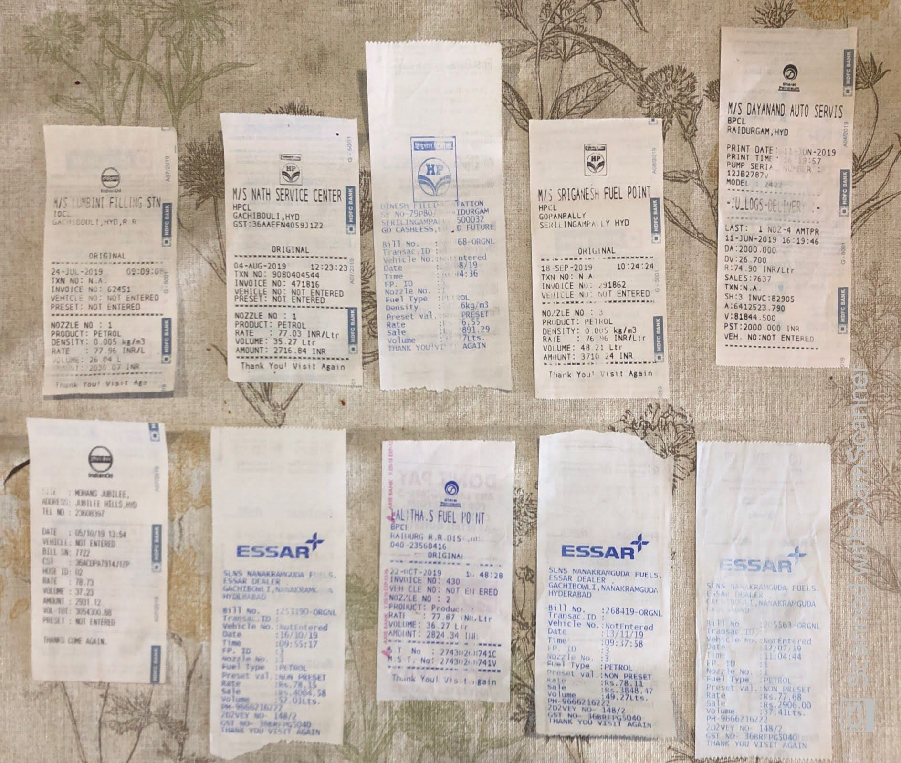
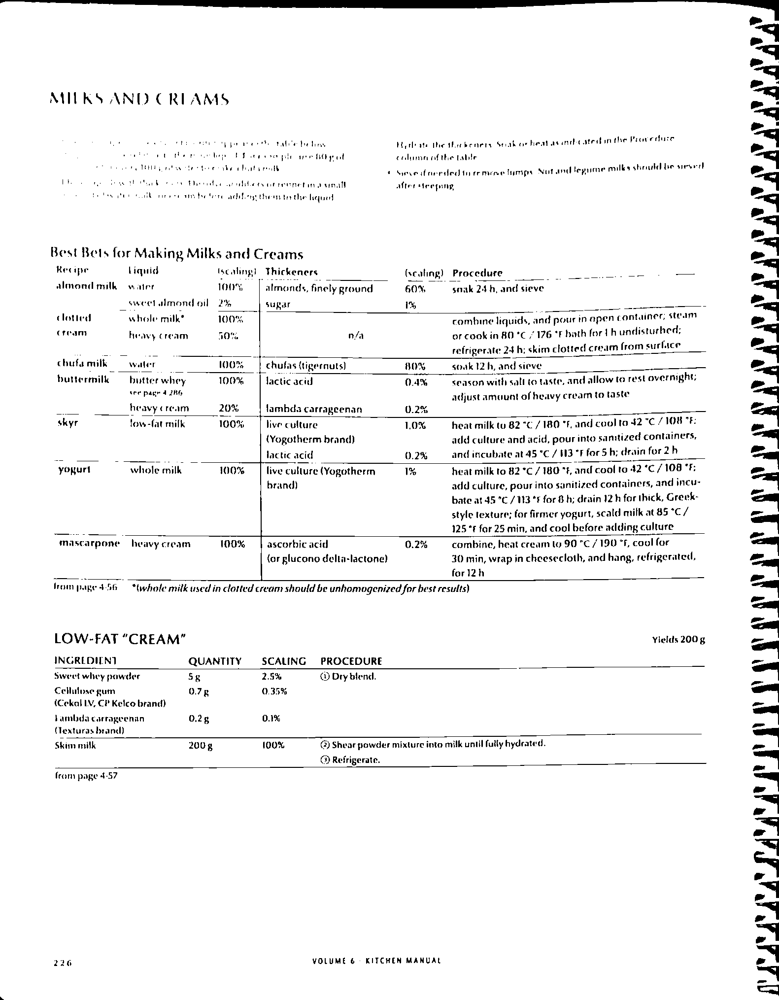
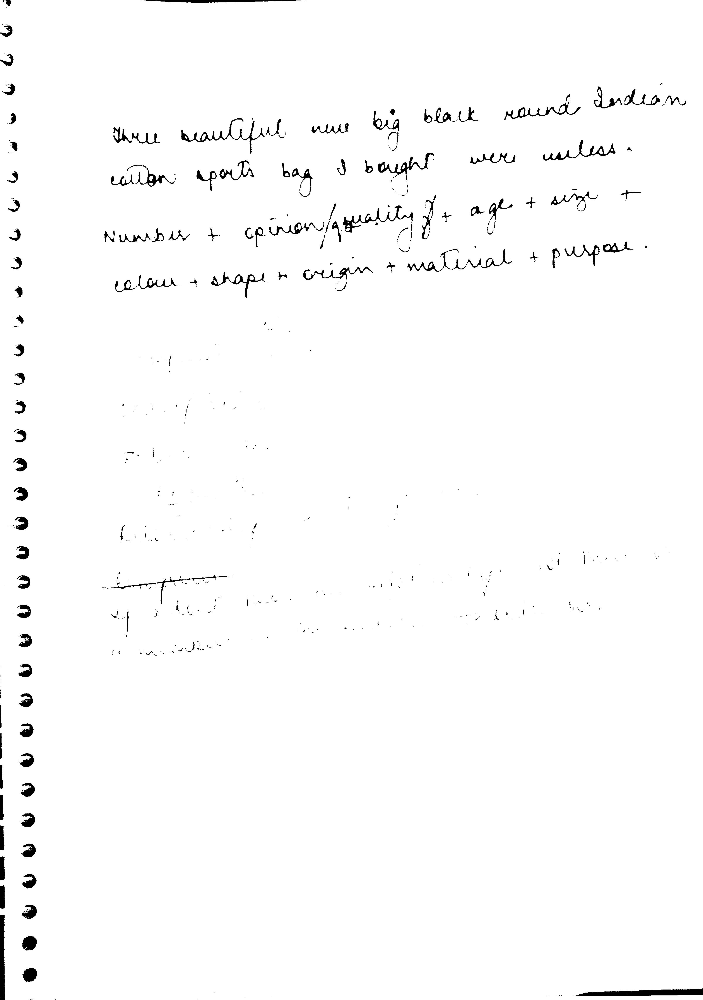
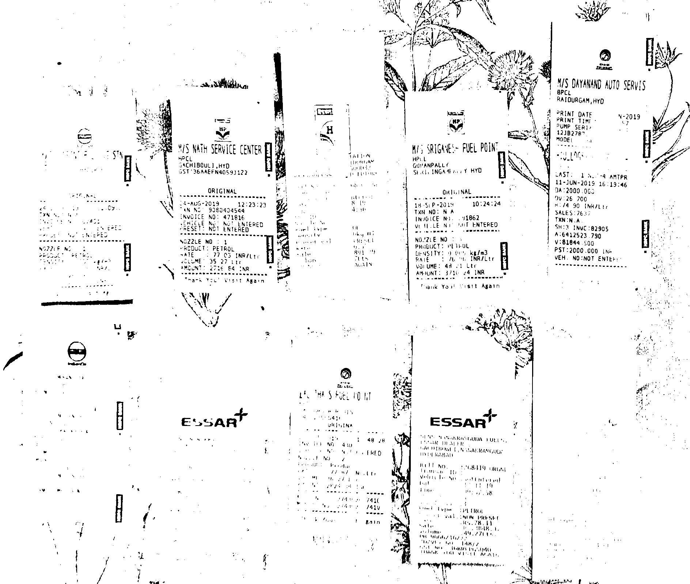
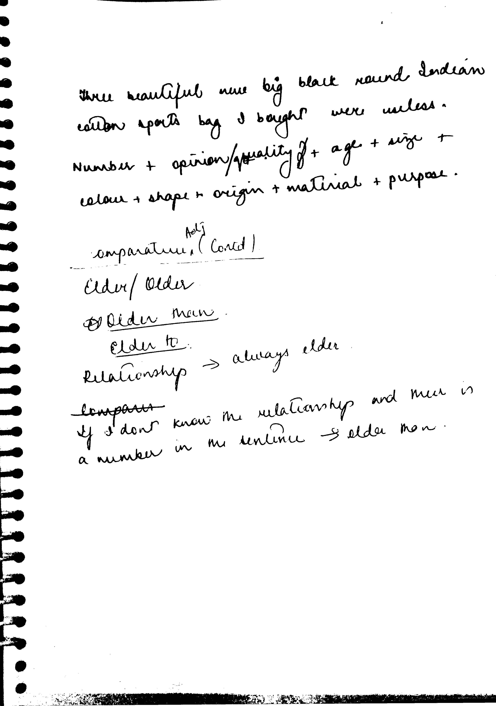

# Binarization
Binarization is a technique to segment foreground from the background pixels. A simple technique for binarization is thresholding of gray-level or color document scanned images.
## At a glance

This binarization technique is an improvement over Sauvola's binarization technique. In this work, we improve the existing Sauvola's binarization technique by preserving more foreground information in the binarized document-images. In order to achieve this, we introduce a confidence score for the background pixels. 

### Input images

 </img>
 </img>
 </img>

### Sauvola outputs

 </img>
 </img>
 </img>

### Confidence based Sauvola outputs

 </img>
 </img>
 </img>

## Reference

For details refer to this [paper](./ModifiedSauvola.pdf) 

## Setup

### Dependencies
- python 3.7
- numpy 1.16
- opencv 4.2
- skimage 0.17

### Example

Sample example of the usage of the said binarization technique can be found in this [notebook](./Modified-Sauvola_Binarization.ipynb).
