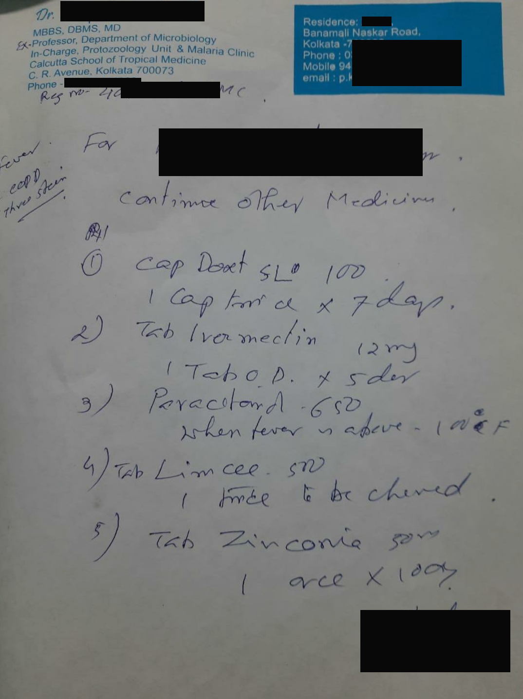
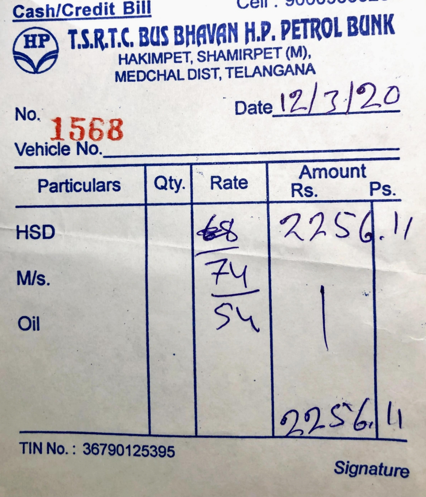
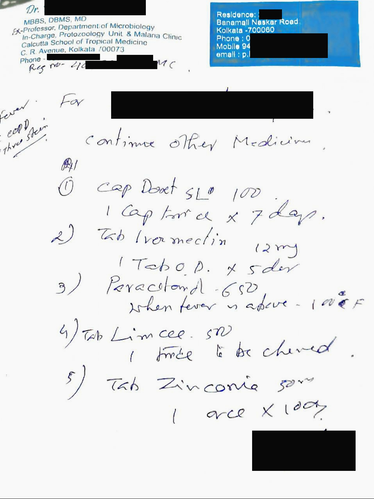
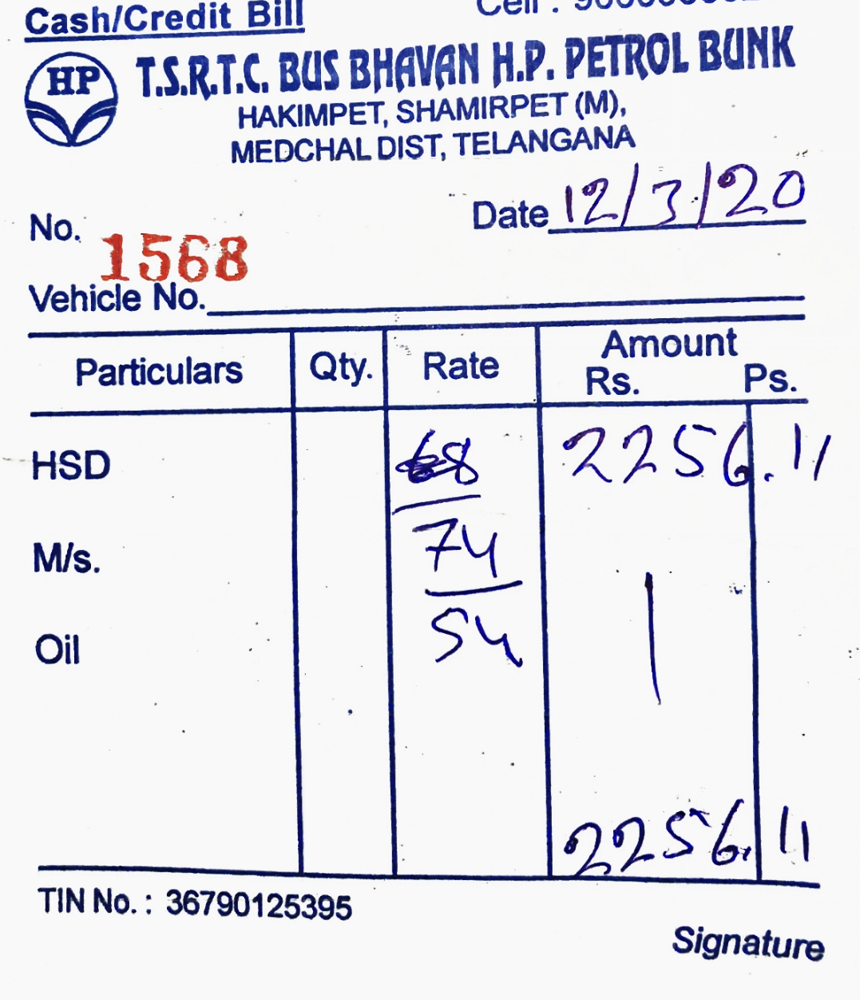

# Document Image Cleanup
Given an input noisy document image, the aim of document image cleanup is to improve its readability and visibility by removing the noisy elements.

## Example of document image cleanup

### Noisy input images

 </img>
 </img>
 </img>

### cleanup images

 </img>
 </img>
 </img>
