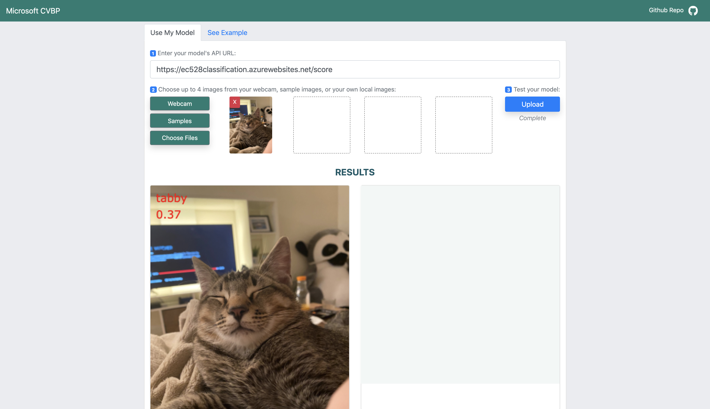
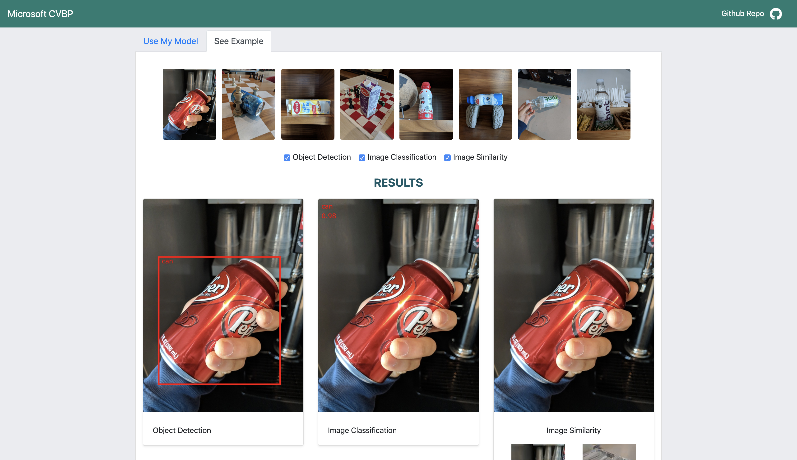

## HTML Demo

### Project Description

This project provides an HTML web page that allows users to visualize the output of a deployed computer vision DNN model. Users can improve on and gain insights from their deployed model by uploading query/test images and examining the model's results for correctness through the user interface. The web page includes some sample query/test images from the Microsoft image set, as well as example output for 3 types of models: Image Classification, Object Detection, and Image Similarity.


### Requirements

This repo has the following requirements:
- Azure account
- [Azure CLI](https://docs.microsoft.com/en-us/cli/azure/install-azure-cli?view=azure-cli-latest)
- Conda environment created in the computervision-recipes [Setup Guide](https://github.com/microsoft/computervision-recipes/blob/master/SETUP.md)

Some of the notebooks in the JupyterCode repository will also instruct you to run some of the existing [scenario notebooks](https://github.com/microsoft/computervision-recipes/tree/master/scenarios).

### Usage

#### Setup
- Clone the repo
```bash
git clone git@github.com:microsoft/ComputerVision.git
```

- Execute the notebooks in JupyterCode in your conda environment to deploy a model and upload necessary code for the web page to work

#### Using the web page

To use a deployed model in the Use My Model tab:

1. Enter the model's API URL in the text field
1. Upload or select images to use:
  1. Webcam
    1. Allow the browser to use your web cam
    1. Select Capture Image to take a picture
    1. Select Add Images to add the captured image
  1. Samples
    1. Select an image by clicking on it
  1. Choose Files
    1. Select images to upload from your machine's file explorer
1. Select Upload to send the images to the model's API
1. View results below!

To view examples in the See Example tab:

1. Click on an image you wish to view
2. See results from image classification, object detection, and image similarity models below!

### Photo
Below is a screenshot of the working website with Use My Model 

In "Use My Model" tab on the website, users can select multiple images and test their DNN model's API and see the visualization of the model's API.


In "See Example" tab on the website, users can click on example images and view the visualization of three DNN models (Image Classification, Object Detection, Image Similarity)


### File List

├── JupyterCode 		# Helper notebooks to deploy model and upload needed files							
│   ├── 13_image_similarity_export.ipynb
│   ├── 20_upload_ui.ipynb
│   ├── 30_deployment_to_azure_app_service.ipynb
│   └── readme.md
├── UICode 				# HTML, script, and CSS files for the web page
│   ├── example_imgs.js
│   ├── index.html
│   ├── readme.md
│   ├── references.txt
│   ├── script.js
│   └── style.css
└── readme.md


***THIS IS A WORK IN PROGRESS***

### Missing or Incomplete as of April 9, 2020
- UICode/index.html (still being revised)
- UICode/script.js (still being revised)
- UICode/style.css (still being revised)
- JupyterCode/20_upload_ui.ipynb (needs additional context and instructions to help user create Azure Blob storage to host HTML files)
- Images for this readme for the "Using the web page" section


### Authors

This work was completed by a team of students from the Boston University College of Engineering as part of the EC528 Cloud Computing class. The project was completed in collaboration with three Microsoft engineers who proposed the project and acted as team mentors.

**Student team:** Matthew Boyd, Charles Henneberger, Xushan "Mulla" Hu, SeungYeun "Kelly" Lee, Nuwapa "Prim" Promchotichai

**Microsoft mentors:** Patrick Buehler, Young Park, JS Tan
