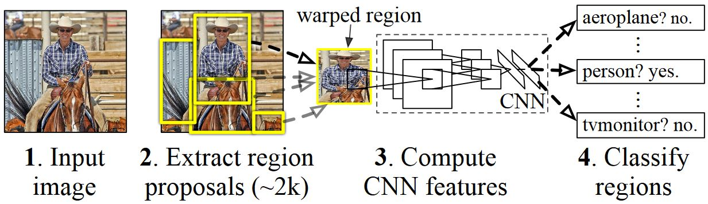

# Object Detection

## Frequently asked questions

This document tries to answer frequent questions related to object detection. For generic Machine Learning questions, such as "How many training examples do I need?" or "How to monitor GPU usage during training?" see also the image classification [FAQ](https://github.com/microsoft/ComputerVision/blob/master/classification/FAQ.md).

* General

* Data
  * [How to annotate images?](#how-to-annotate-images)

* Technology
  * [How does the technology work?](#how-does-the-technology-work)
  * [R-CNN object detection approaches](#r-cnn-object-detection-approaches)
  * [Intersection-over-Union overlap metric](#intersection-over-union-overlap-metric)
  * [Non-maxima suppression](#non-maxima-suppression)
  * [Mean Average Precision](#mean-average-precision)

## General

## Data

### How to annotate images?

Annotated object locations are required to train and evaluate an object detector. Open source UIs such as [LabelImg](https://tzutalin.github.io/labelImg) can be used to manually draw rectangles around one or more objects in an image. LabelImg writes all annotations to a single xml-file per image (in Pascal-VOC format) which can be read using the provided code. Here is a screenshot of the LabelImg UI:

Annotating images is complex and consistency is key. For example:
* Occluded objects should either be always annotated, or never.
* Ambiguous images should be removed, for example if it is unclear to a human if an object is lemon or a tennis ball.
* Ensuring consistency is difficult especially if multiple people are involved. Hence our recommendation is, if possible, that the person who trains the model annotates all images. This also helps in gaining a better understanding of the problem domain.

Especially the test set used for evaluation should be of high annotation quality so that accuracy measures reflect the true performance of the model. The training set can, but ideally shouldn't be, noisy.

## Technology

### How does the technology work?
State-of-the-art object detection methods, such as used in this repository, are based on Convolutional Neural Networks (CNN) which have been shown to work well on image data. Most such methods use a CNN as backbone which was pre-trained on millions of images (typically using the [ImageNet](http://image-net.org/index) dataset). Such a pre-trained model is then incorporated into an object detection pipeline, and can be fine-tuned with only a small amount of annotated images. For a more detailed explanation of "fine-tuning", including code examples, see the [classification](../classification/) folder.

### R-CNN Object Detection Approaches
R-CNNs for Object Detection were introduced in 2014 by [Ross Girshick et al.](http://arxiv.org/abs/1311.2524), and shown to outperform previous state-of-the-art approaches on one of the major object recognition challenges: [Pascal VOC](http://host.robots.ox.ac.uk/pascal/VOC/). The main drawback of the approach was its slow inference speed. Since then, three major follow-up papers were published which introduced significant speed improvements: [Fast R-CNN](https://arxiv.org/pdf/1504.08083v2.pdf) and [Faster R-CNN](https://arxiv.org/abs/1506.01497), and [Mask R-CNN](https://arxiv.org/pdf/1703.06870.pdf).

Similar to most object detection methods, R-CNN use a deep Neural Network which was trained for image classification using millions of annotated images and modify it for the purpose of object detection. The basic idea from the first R-CNN paper is illustrated in the figure below (taken from the paper):
  1. Given an input image
  2. A large number region proposals, aka Regions-of-Interests (ROIs), are generated.
  3. These ROIs are then independently sent through the network which outputs a vector of e.g. 4096 floating point values for each ROI.
  4. Finally, a classifier is learned which takes the 4096 floats ROI representation as input and outputs a label and confidence to each ROI.  

While this approach works well in terms of accuracy, it is very costly to compute since the Neural Network has to be evaluated for each ROI. Fast R-CNN addresses this drawback by only evaluating most of the network (to be specific: the convolution layers) a single time per image. According to the authors, this leads to a 213 times speed-up during testing and a 9x speed-up during training without loss of accuracy. Faster R-CNN then shows how ROIs can be computed as part of the network, essentially combining all steps in the figure above into a single DNN.

### Intersection-over-Union overlap metric
It is often necessary to measure by how much two given rectangles overlap. For example, one rectangle might correspond to the ground-truth location of an object, while the second rectangle corresponds to the estimated location, and the goal is to measure how precise the object was detected.

For this, a metric called Intersection-over-Union (IoU) is typically used. In the example below, the IoU is given by dividing the yellow area by the combined yellow and blue areas. An IoU of 1.0 corresponds to a perfect match, while an IoU of 0 indicates that the two rectangles do not overlap. Typically an IoU of 0.5 is considered a good localization. See also this [page](https://www.pyimagesearch.com/2016/11/07/intersection-over-union-iou-for-object-detection/) for a more in-depth discussion.     

### Non-maxima suppression
Object detection methods often output multiple detections which fully or partly cover the same object in an image. These detections need to be pruned to be able to count objects and obtain their exact locations. This is traditionally done using a technique called Non-Maxima Suppression (NMS), and is implemented by iteratively selecting the detection with highest confidence and removing all other detections which (i) are classified to be of the same class; and (ii) have a significant overlap measured using the Intersection-over-Union (IOU) metric.

Detection results with confidence scores before (left) and after non-maxima Suppression using IOU thresholds of (middle) 0.8 and (right) 0.5:

### Mean Average Precision
Once trained, the quality of the model can be measured using different criteria, such as precision, recall, accuracy, area-under-curve, etc. A common metric which is used for the Pascal VOC object recognition challenge is to measure the Average Precision (AP) for each class. Average Precision takes confidence in the detections into account and hence assigns a smaller penalty to false detections with low confidence. For a description of Average Precision see [Everingham et. al](http://homepages.inf.ed.ac.uk/ckiw/postscript/ijcv_voc09.pdf). The mean Average Precision (mAP) is then computed by taking the average over all APs.
