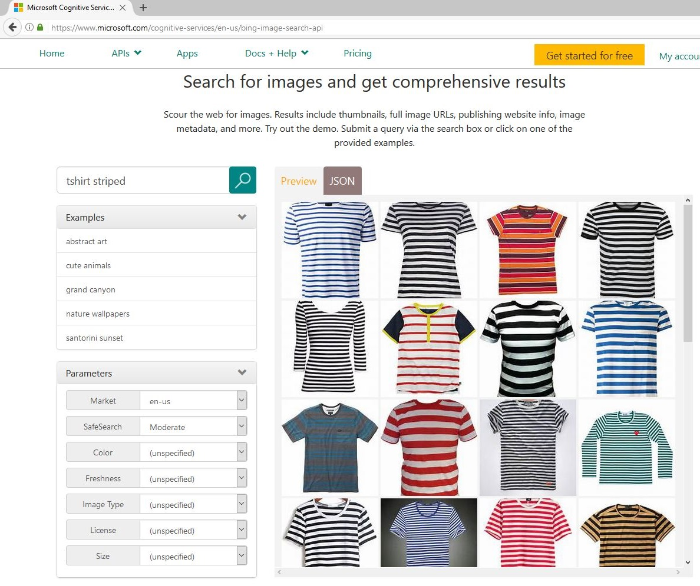

# Image classification

## Frequently asked questions

* General
  * [How does the technology work](#how-does-the-technology-work)
  * [Which problems can be solved using image classification, and which ones cannot](#which-problems-can-be-solved-using-image-classification)
* Data
  * [How many images are required to train a model](#how-many-images-are-required-to-train-a-model)
  * [How to augment image data](#how-to-augment-image-data)
  * [How to collect a large set of images](#how-to-collect-a-large-set-of-images)
  * [How to annotate images](#how-to-annotate-images)
  * [How to split into training and test images](#how-to-split-into-training-and-test-images)
  * [How to design a good test set](#how-to-design-a-good-test-set)
* Training
  * [How to speed up training](#how-to-speed-up-training)
  * [How to improve accuracy or inference speed](#how-to-improve-accuracy-or-inference-speed)
  * [How to monitor GPU usage during training](#how-to-monitor-gpu-usage-during-training)

### How does the technology work
State-of-the-art image classification methods such as used in this repository are based on Convolutional Neural Networks (CNN). CNNs are a special group of Deep Learning (DL) approaches shown to work well on image data. The key is to use CNNs which were already trained on millions of images (typically using the [ImageNet](http://image-net.org/index) dataset) and to fine-tune these pre-trained CNNs using a potentially much smaller custom dataset. This is the approach also taken in this repository.

Transfer-learning using CNNs easily outperforms "traditional" (non-DL) approaches in terms of accuracy, easy of implementation, and often also inference speed. In fact, how to design Computer Vision systems changed completely ever since the influential [AlexNet](https://papers.nips.cc/paper/4824-imagenet-classification-with-deep-convolutional-neural-networks.pdf) paper was published in 2012. Before, CV researchers spend most time on designing features which capture the discriminative information of a given problem. These features were often hand-designed and very problem specific. Due in large parts to the success of the AlexNet paper, most time to build a CV solution is now spend on collecting and annotating data, as well as fine-tuning CNN parameters.

The AlexNet DNN architecture (shown below) consists of 8 layers: 5 convolution layers followed by 3 fully connected layers. Early layers learn low-level features (e.g. lines, edges) which are combined by successive layers into ever more complex concepts (e.g. wheel, face). More recent architectures (e.g. [ResNet](https://arxiv.org/abs/1512.03385)) are much deeper than AlexNet and consist of possibly hundrets of layers, and use more advanced techniques to help model convergence (e.g. Batch Normalization).  

The research community studied transfer learning in detail, including the great survey paper [CNN Features off-the-shelf: an Astounding Baseline for Recognition](http://openaccess.thecvf.com/content_cvpr_workshops_2014/W15/papers/Razavian_CNN_Features_Off-the-Shelf_2014_CVPR_paper.pdf) by Razavian et. al.  In addition, the web is full of introductions to CNNs and related conceptions, such as [link1](https://towardsdatascience.com/simple-introduction-to-convolutional-neural-networks-cdf8d3077bac) or [link2](https://ujjwalkarn.me/2016/08/11/intuitive-explanation-convnets/).

### Which problems can be solved using image classification
Image classification can be used if the object-of-interest is relatively large in the image, e.g. more than 20% image width/height. If the object is smaller, or if the location of the object is required, then object detection methods should be used instead.

### How many images are required to train a model
This depends heavily on the complexity of the problem. For example, if the object-of-interest looks very different from image to image (viewing angle, lighting condition, etc) then more training images are required for the model to learn the appearance of the object.

In practice, we have seen good results using 100 images for each class or sometime less. The only way to find out how many images are required, is by training the model using increasing number of images, while observing how the accuracy improves (while keeping the test set fixed). Once accuracy improvements become small, this would indicate that more training images are not required.

### How to augment image data
Using more training data can make the model generalize better, but data collection is very expensive.
Alternatively, augmenting the training data with minor alterations has been proven to work well,
which saves your time and money to collect more data as well as prevents model from overfitting.
Some [image transformations](https://docs.fast.ai/vision.transform.html) such as rotation, cropping,
and adjusting brightness / contrast are widely used for data augmentation in image classification,
but they do not necessarily work on all the problems.
You should only apply transformations if the transformed images end up looking like the data you plan to score on.
For example, as you can see from the figure below, flipping horizontally and vertically (flip_h and flip_v in the figure)
will harm the model performance in character recognition.
For bottle images, vertical flipping still does not look good for improving the model accuracy while horizontal flipping does.
On the other hand, both flipping transforms will be useful for satellite images as shown in the figure.

*Examples of different image transformations
(First row: [MNIST](http://yann.lecun.com/exdb/mnist/), second row: Fridge Object, third row: [Planet](https://www.kaggle.com/c/planet-understanding-the-amazon-from-space/data))*

### How to collect a large set of images
Collecting a sufficiently large number of annotated images for training and testing can be difficult. One way to over-come this problem is to scrape images from the Internet. For example, see below (left image) the Bing Image Search results for the query "tshirt striped". As expected, most images indeed are striped t-shirts, and the few incorrect or ambiguous images (such as column 1, row 1; or column 3, row 2) can be identified and removed easily. Rather than manually downloading images from Bing Image Search, the [Cognitive Services Bing Image Search API](https://www.microsoft.com/cognitive-services/en-us/bing-image-search-api) (right image) can be used instead.

|Bing Image Search         | Cognitive Services Image Search|
|:-------------------------:|:-------------------------:|
| |  |

To generate a large and diverse dataset, multiple queries should be used. For example 7\*3 = 21 queries can by synthesized using all combinations of 7 clothing items {blouse, hoodie, pullover, sweater, shirt, tshirt, vest} and 3 attributes {striped, dotted, leopard}. Downloading the top 50 images per query would then lead to a maximum of 21*50=1050 images.

Some of the downloaded images will be exact or near duplicates (e.g. differ just by image resolution or jpg artifacts) and should be removed so that the training and test split do not contain the same images. This can be achieved using a hashing-based approach which works in two steps: (i) first, the hash string is computed for all images; (ii) only images are kept with a hash string which has not yet been seen. All other images are discarded. We found the *dhash* approach in the Python library *imagehash* and described in this [blog](http://www.hackerfactor.com/blog/index.php?/archives/529-Kind-of-Like-That.html) to perform well, with the parameter `hash_size` set to 16. It is OK to incorrectly remove some non-duplicates images, as long as the majority of the real duplicates get removed.

### How to annotate images
Consistency is key. For example, occluded objects should either be always annotated, or never. Furthermore, ambiguous images should be removed, eg if it is unclear to a human eye if an image shows a lemon or a tennis ball. Ensuring consistency is difficult especially if multiple people are involved, and hence our recommendation is that only a single person, the one who trains the AI model, annotates all images. This has the added benefit of gaining a better understanding of the images and of the complexity of the classification task.

Note that the test set should be of high annotation quality, so that accuracy estimates are reliable.

### How to split into training and test images
Often a random split, as is performed in the notebooks, is fine. However, there are exceptions: for example, if the images are extracted from a movie, then having frame *n* in the training set and frame *n+1* in the test set would result in accuracy estimates which are over-inflated since the two images are too similar.

### How to design a good test set
The test set should contain images which resemble what the input to the trained model looks like when deployed. For example, images taken under similar lighting conditions, similar angles, etc. This is to ensure that the accuracy estimate reflects the real performance of the application which uses the trained model.

### How to speed up training
- All images should be stored on an SSD device, since HDD or network access times can dominate the training time due to high latency.
- Very high-resolution images (>4 MegaPixels) should be downsized before DNN training since JPEG decoding is expensive and can slow down training by a factor of >10x.
- High-resolution images can slow down training due to JPEG decoding becoming the bottleneck. See the [02_training_accuracy_vs_speed.ipynb](notebooks/02_training_accuracy_vs_speed.ipynb) notebook for more information.

### How to improve accuracy or inference speed
See the [02_training_accuracy_vs_speed.ipynb](notebooks/02_training_accuracy_vs_speed.ipynb) notebook for a discussion what parameters are important, and how to select a model which is fast during inference.

### How to monitor GPU usage during training
Various useful tools to monitor real-time GPU information (e.g. GPU or memory load) exist, including:
- [GPU-Z](https://www.techpowerup.com/gpuz/): easy to install UI.
- [nvidia-smi](https://developer.nvidia.com/nvidia-system-management-interface): command line tool. Pre-installed on the Azure Data Science VM.
- [GPU monitor](https://github.com/msalvaris/gpu_monitor): python SDK for monitoring GPU on a single machine or across a cluster.
