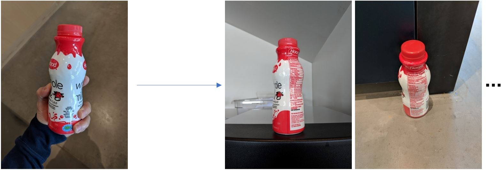
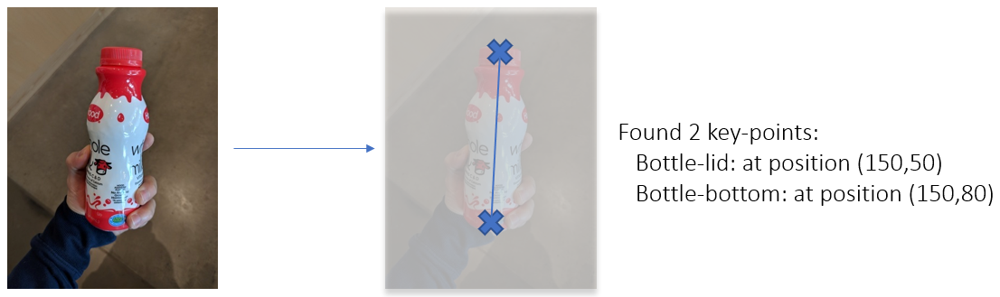

# Overview

| Scenario | Description |
| -------- | ----------- |
| [Classification](classification) | Image Classification is a supervised machine learning technique to learn and predict the category of a given image. |
| [Similarity](similarity)  | Image Similarity is a way to compute a similarity score given a pair of images. Given an image, it allows you to identify the most similar image in a given dataset.  |
| [Detection](detection) | Object Detection is a technique that allows you to detect the bounding box of an object within an image. |
| [Keypoints](keypoints) | Keypoint Detection can be used to detect specific points on an object. A pre-trained model is provided to detect body joints for human pose estimation. |
| [Segmentation](segmentation) | Image Segmentation assigns a category to each pixel in an image. |
| [Action Recognition](action_recognition) | Action Recognition (also known as activity recognition) consists of classifying various actions from a sequence of frames, such as "reading" or "drinking". |
| [Tracking](tracking) | Tracking allows to detect and track multiple objects in a video sequence over time. |


# Scenarios

While the field of Computer Vision is growing rapidly, the majority of vision applications fall into one of these 4 categories:

- **Image classification**: Given an input image, predict what object is present in the image. This is typically the easiest CV problem to solve, however classification requires objects to be reasonably large in the image.

&nbsp;&nbsp;&nbsp;&nbsp;&nbsp;&nbsp;   


- **Image Similarity** Given an input image, find all similar objects in images from a reference dataset. Here, rather than predicting a label and/or rectangle, the task is to sort through a reference dataset to find objects similar to that found in the query image.

&nbsp;&nbsp;&nbsp;&nbsp;&nbsp;&nbsp; 

- **Object Detection**: Given an input image, identify and locate which objects are present (using rectangular coordinates). Object detection can find small objects in an image. Compared to image classification, both model training and manually annotating images is more time-consuming in object detection, since both the label and location are required.

&nbsp;&nbsp;&nbsp;&nbsp;&nbsp;&nbsp; 

- **Keypoint Detection**: Given an input image, identify and locate keypoints. Conceptually this runs an object detector first, followed by detecting keypoints on the objects. In practice, a single model runs both steps (almost) at once.

&nbsp;&nbsp;&nbsp;&nbsp;&nbsp;&nbsp; 

- **Image Segmentation** Given an input image, assign a label to every pixel (e.g., background, bottle, hand, sky, etc.). In practice, this problem is less common in industry, in large part due to time required to label the ground truth segmentation required in order to train a solution.

&nbsp;&nbsp;&nbsp;&nbsp;&nbsp;&nbsp; 

# Data/Telemetry

The following notebooks collect browser usage data and sends it to Microsoft to help improve our product and services:
- [classification/20_azure_workspace_setup](classification/20_azure_workspace_setup.ipynb)
- [classification/21_deployment_on_azure_container_instances](classification/21_deployment_on_azure_container_instances.ipynb)
- [classification/22_deployment_on_azure_kubernetes_service](classification/22_deployment_on_azure_kubernetes_service.ipynb)
- [classification/23_aci_aks_web_service_testing](classification/23_aci_aks_web_service_testing.ipynb)
- [classification/24_exploring_hyperparameters_on_azureml](classification/24_exploring_hyperparameters_on_azureml.ipynb)
- [detection/11_exploring_hyperparameters_on_azureml](detection/11_exploring_hyperparameters_on_azureml.ipynb)

Read Microsoft's [privacy statement to learn more](https://privacy.microsoft.com/en-US/privacystatement).

To opt out of tracking, please go to the raw `.ipynb` files and remove the following line of code (the URL will be slightly different depending on the file):

```sh
    ""
```
