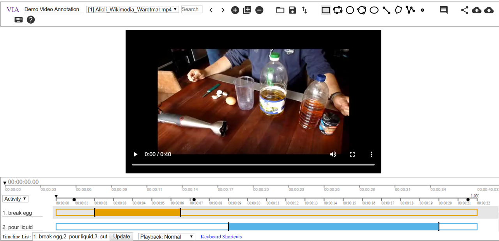

# Video Annotation Summary For Action Recognition

To create a training or evaluation set for action recognition, the ground truth start/end position of actions in videos needs to be annotated. We looked into various tools for this and the tool we liked most (by far) is called [VGG Image Annotator (VIA)](http://www.robots.ox.ac.uk/~vgg/software/via/) written by the VGG group at Oxford.

## Instructions For Using VIA Tool

We will now provide a few tips/steps how to use the VIA tool. A fully functioning live demo of the tool can be found [here](http://www.robots.ox.ac.uk/~vgg/software/via/demo/via_video_annotator.html).

Screenshot of VIA Tool

How to use the tool for action recognition:
- Step 1: Download the zip file from the link [here](http://www.robots.ox.ac.uk/~vgg/software/via/downloads/via-1.0.6.zip).
- Step 2: Unzip the tool and open the *via_video_annotator.html* to open the annotation tool. *Note: support for some browsers seems not fully stable - we found Chrome to work best.*
- Step 3: Import the video file(s) from local using  or from url using .
- Step 4: Use  to create a new attribute for action annotation. Select *Temporal Segment in Video or Audio* for *Anchor*. To see the created attribute, click  again.
- Step 5: Update the *Timeline List* with the actions you want to track. Split different actions by e.g "1. eat, 2. drink" for two tracks separately for *eat* and *drink*. Click *update* to see the updated tracks.
- Step 6: Click on one track to add segment annotations for a certain action. Use key `a` to add the temporal segment at the current time and `Shift + a` to update the edge of the temporal segment to the current time.
- Step 7: Export the annotations using . Select *Only Temporal Segments as CSV* if you only have temporal segments annotations.

## Scripts for use with the VIA Tool

The VIA tool outputs annotations as a csv file. Often however we need each annotated action to be written as its own clip and into separate files. These clips can then serve as training examples for action recognition models. We provide some scripts to aid in the construction of such datasets:
- [video_conversion.py](./video_conversion.py) - Conversion of the video clips to a format which the VIA tool knows how to read.
- [clip_extraction.py](./clip_extraction.py) - Extraction of each annotated action as a separate clip. Optionally, "negative" clips can be generated, in which no action-of-interest occurs. Negative clips can be extracted in two ways: either all contiguous non-overlapping negative clips can be extracted or a specified number of negative examples can be randomly sampled. This behaviour can be controlled using the `contiguous` flag. The script outputs clips into directories specific to each class and generates a label file that maps each filename to the clip's class label.
- [split_examples.py](./split_examples.py) - Splits generated example clips into training and evaluation sets. Optionally, a negative candidate set and negative test set can be generated for hard negative mining.

## Annotation Tools Comparison

Below is a list of alternative UIs for annotating actions, however in our opinion the VIA tool is the by far best performer. We distinguish between:
- Fixed-length clip annotation: where the UI splits the video into fixed-length clips, and the user then annotates the clips.
- Segmentations annotation: where the user annotates the exact start and end position of each action directly. This is more time-consuming compared to fixed-length clip annotation, however comes with higher localization accuracy.

See also the [HACS Dataset web page](http://hacs.csail.mit.edu/index.html#explore) for some examples showing these two types of annotations.

| Tool Name      | Annotation Type |Pros|Cons|Whether Open Source|
| ----------- | ----------- |----------- |----------- |----------- |
| [MuViLab](https://github.com/ale152/muvilab)      | Fixed-length clips annotation       | <ul><li> Accelerate clip annotation by displaying many clips at the same time</li> <li> Especially helpful when the actions are sparse</li></ul>| <ul><li> Not useful when the actions are very short (eg a second)</li></ul>|Open source on Github|
| [VIA (VGG Image Annotator)](http://www.robots.ox.ac.uk/~vgg/software/via/)   | segmentations annotation|<ul><li> Light-weight, no prerequisite besides downloading a zip file</li>   <li> Actively developed Gitlab project </li>  <li> Support for: annotating video in high precision(on milliseconds and frame), previewing the annotated clips, export start and end time of the actions to csv, annotating multiple actions in different track on the same video </li>  <li> Easy to ramp-up and use</li></ul>|<ul><li> Code can be instabilities, e.g sometimes the tool becomes unresponsive.</li></ul>|Open source on Gitlab|
|[ANVIL](http://www.anvil-software.org/#)|Segmentations annotation|<ul> <li> Support for high precision annotation, export the start and end time.</li></ul>| <ul><li> Heavier prerequisite with Java required </li>  <li> Harder to ramp-up compared to VIA with lots of specifications, etc. </li>  <li> Java-related issues can make the tool difficult to run. </li></ul>|Not open source, but free to download|
|[Action Annotation Tool](https://github.com/devyhia/action-annotation)| Segmentations annotation|<ul><li> Add labels to key frames in video</li>   <li> Support high precision to milliseconds</li></ul>|<ul><li> Much less convenient compared to VIA or ANVIL</li>    <li> Not in active delevepment</li></ul>|Open source on Github|

## References
- [Deep Learning for Videos: A 2018 Guide to Action Recognition.](http://blog.qure.ai/notes/deep-learning-for-videos-action-recognition-review#targetText=Action%20recognition%20by%20dense%20trajectories,Trajectories%20by%20Wang%20et%20al)
- [Zhao, H., et al. "Hacs: Human action clips and segments dataset for recognition and temporal localization." arXiv preprint arXiv:1712.09374 (2019).](https://arxiv.org/abs/1712.09374)
- [Kay, Will, et al. "The kinetics human action video dataset." arXiv preprint arXiv:1705.06950 (2017).](https://arxiv.org/abs/1705.06950)
- [Abhishek Dutta and Andrew Zisserman. 2019. The VIA Annotation Software for Images, Audio and Video. In Proceedings of the 27th ACM International Conference on Multimedia (MM ’19), October 21–25, 2019, Nice, France. ACM, New York, NY, USA, 4 pages. https://doi.org/10.1145/3343031.3350535.](https://arxiv.org/abs/1904.10699)
