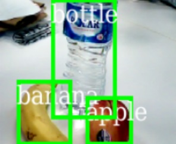

# Object Detection

This directory provides examples and best practices for building object detection systems. Our goal is to enable the users to bring their own datasets and train a high-accuracy model easily and quickly. To this end, we provide example notebooks with pre-set default parameters shown to work well on a variety of datasets, and extensive documentation of common pitfalls, best practices, etc.

| Object detection | Object detection and segmentation | Object detection and keypoint localization |
|--|--|--|
|  |   |   |

Object Detection is one of the main problems in Computer Vision. Traditionally, this required expert knowledge to identify and implement so called “features” that highlight the position of objects in the image. Starting in 2012 with the famous AlexNet and Fast(er) R-CNN papers, Deep Neural Networks are used to automatically find these features. This lead to a huge improvement in the field for a large range of problems.

This repository uses [torchvision's](https://pytorch.org/docs/stable/torchvision/index.html) Faster R-CNN implementation which has been shown to work well on a wide variety of Computer Vision problems. See the [FAQ](FAQ.md) for an explanation of the underlying data science aspects.

We recommend running these samples on a machine with GPU, on either Linux or (~20% slower) Windows. While a GPU is technically not required, training gets prohibitively slow even when using only a few dozens of images.

## Frequently asked questions

Answers to frequently asked questions such as "How does the technology work?" can be found in the [FAQ](FAQ.md) located in this folder. For generic questions such as "How many training examples do I need?" or "How to monitor GPU usage during training?" see the [FAQ.md](../classification/FAQ.md) in the classification folder.

## Notebooks

We provide several notebooks to show how object detection algorithms can be designed and evaluated:

| Notebook name | Description |
| --- | --- |
| [00_webcam.ipynb](./00_webcam.ipynb)| Quick-start notebook which demonstrates how to build an object detection system using a single image or webcam as input.
| [01_training_introduction.ipynb](./01_training_introduction.ipynb)| Notebook which explains the basic concepts around model training and evaluation.|
| [02_mask_rcnn.ipynb](./02_mask_rcnn.ipynb) | In addition to detecting objects, also find their precise pixel-masks in an image. |
| [03_keypoint_rcnn.ipynb](../detection/03_keypoint_rcnn.ipynb)| Notebook which shows how to (i) run a pre-trained model for human pose estimation; and (ii) train a custom keypoint detection model.|
| [11_exploring_hyperparameters_on_azureml.ipynb](./11_exploring_hyperparameters_on_azureml.ipynb)| Performs highly parallel parameter sweeping using AzureML's HyperDrive. |
| [12_hard_negative_sampling.ipynb](./12_hard_negative_sampling.ipynb) | Demonstrates how to sample hard negatives to improve model performance. |
| [20_deployment_on_kubernetes.ipynb](./20_deployment_on_kubernetes.ipynb) | Deploys a trained model using AzureML. |

## Contribution guidelines

See the [contribution guidelines](../../CONTRIBUTING.md) in the root folder.
