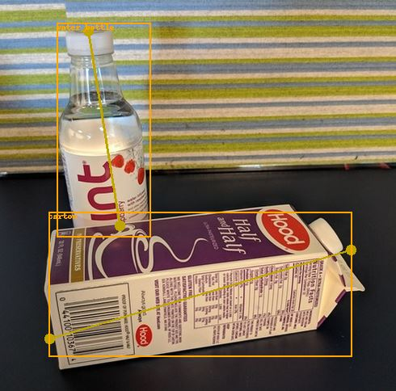
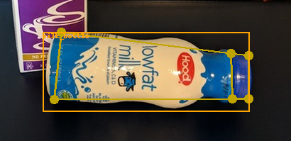
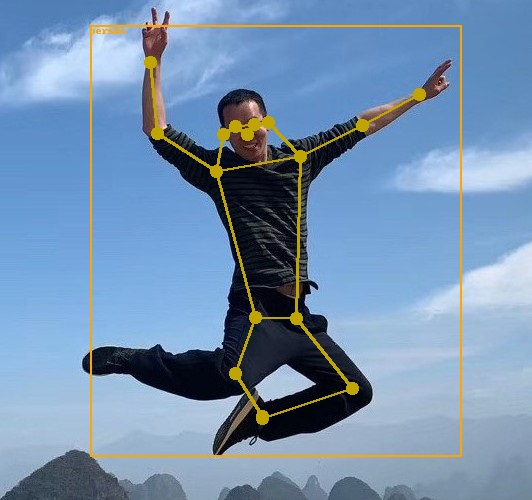

# Keypoint Detection

This repository contains examples and best practice guidelines for building keypoint detection systems. It also shows how to use a pre-trained model for human pose estimation.

Keypoints are defined as points-of-interests on objects. For example, one might be interested in finding the position of the lid on a bottle. Another example is to find body joints (hands, shoulders, etc.) for human pose estimation.

We use an extension of Mask R-CNN which simultaneously detects objects and their keypoints. The underlying technology is very similar to our approach for object detection, ie. based on [Torchvision's](https://pytorch.org/docs/stable/torchvision/index.html) Mask R-CNN. The example notebook for keypoint localization is therefore in the [detection](../detection) folder.

| Detecting the top and bottom on our fridge objects | Detecting various keypoints on milk bottles| Human pose estimation using the provided pre-trained model |
|--|--|--|
|  |  |  |

## Frequently asked questions

See the [FAQ.md](../detection/FAQ.md) in the object detection folder.

## Notebooks

| Notebook name | Description |
| --- | --- |
| [03_keypoint_rcnn.ipynb](../detection/03_keypoint_rcnn.ipynb)| Notebook which shows how to (i) run a pre-trained model for human pose estimation; and (ii) train a custom keypoint detection model.|

## Contribution guidelines

See the [contribution guidelines](../../CONTRIBUTING.md) in the root folder.
