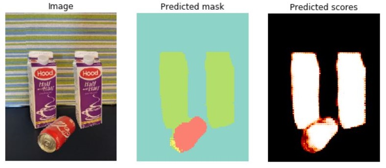

# Image segmentation

This directory provides examples and best practices for building image segmentation systems. Our goal is to enable the users to bring their own datasets and train a high-accuracy model easily and quickly.

| Image segmentation example |
|--|
||

Our implementation uses fastai's [UNet](https://docs.fast.ai/vision.models.unet.html) model, where the CNN backbone (e.g. ResNet) is pre-trained on ImageNet and hence can be fine-tuned with only small amounts of annotated training examples. A good understanding of [image classification](../classification) concepts, while not necessary, is strongly recommended.

## Notebooks

The following notebooks are provided:

| Notebook name | Description |
| --- | --- |
| [01_training_introduction.ipynb](./01_training_introduction.ipynb)| Notebook to train and evaluate an image segmentation model.|
| [11_exploring_hyperparameters.ipynb](11_exploring_hyperparameters.ipynb)| Finds optimal model parameters using grid search. |

## Contribution guidelines

See the [contribution guidelines](../../CONTRIBUTING.md) in the root folder.
