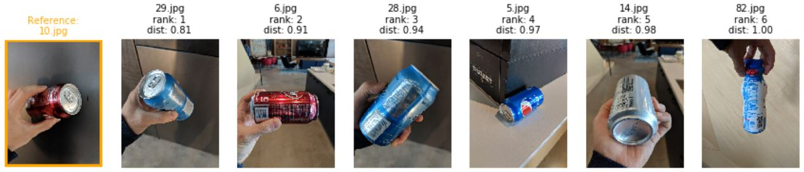

# Image similarity

This directory provides examples and best practices for building image similarity systems. Our goal is to enable the users to bring their own datasets and train a high-accuracy model easily and quickly. To this end, we provide example notebooks with pre-set default parameters shown to work well on a variety of datasets, and extensive documentation of common pitfalls, best practices, etc.

Image retrieval example showing the query image on the left, and the 6 most similar images sorted by their distance to the right:  

  

The majority of state-of-the-art systems for image similarity use DNNs to compute a representation of an image (e.g. a vector of 512 floating point values). The similarity between two images is then defined as the cosine or the L2 distance between their respective DNN representations.

A major difference between modern image similarity approaches is how the DNN is trained. A simple but surprisingly powerful approach is to use a standard image classification loss - this is the approach taken in the [01_training_and_evaluation_introduction.ipynb](01_training_and_evaluation_introduction.ipynb) notebook, and explained in the [classification](../classification/README.md) folder. More accurate models are typically trained explicitly for image similarity using Triplet Learning such as the [FaceNet](https://arxiv.org/pdf/1503.03832.pdf) paper. While triplet-based approaches achieve good accuracies, they are conceptually complex, slower, and more difficult to train/converge due to issue such as how to mine relevant triplets.

Instead, the notebook [02_state_of_the_art.ipynb](02_state_of_the_art.ipynb) implements the BMVC 2019 paper "[Classification is a Strong Baseline for Deep Metric Learning](https://arxiv.org/abs/1811.12649)" which shows that this extra overhead is not necessary. Indeed, by making small changes to standard classification models, the authors achieve results which are comparable or better than the previous state-of-the-art on three common research datasets.

## Frequently asked questions

Answers to Frequently Asked Questions such as "How many images do I need to train a model?" or "How to annotate images?" can be found in the [FAQ.md](FAQ.md) file. For image classification specified questions, see the [FAQ.md](../classification/FAQ.md) in the classification folder.

## Notebooks

We provide several notebooks to show how image similarity algorithms can be designed and evaluated.

| Notebook name | Description |
| --- | --- |
| [00_webcam.ipynb](00_webcam.ipynb)| Quick start notebook which demonstrates how to build an image retrieval system using a single image or webcam as input.
| [01_training_and_evaluation_introduction.ipynb](01_training_and_evaluation_introduction.ipynb)| Notebook which explains the basic concepts around model training and evaluation, based on using DNNs trained for image classification.|
| [02_state_of_the_art.ipynb](02_state_of_the_art.ipynb) | Implementation of a state-of-the-art approach based on the NormSoftmax loss. |
| [11_exploring_hyperparameters.ipynb](11_exploring_hyperparameters.ipynb)| Finds optimal model parameters using grid search. |
| [12_fast_retrieval.ipynb](12_fast_retrieval.ipynb)| Fast image retrieval using nearest neighbor search. |

## Coding guidelines

See the [coding guidelines](../../CONTRIBUTING.md#coding-guidelines) in the root folder.
