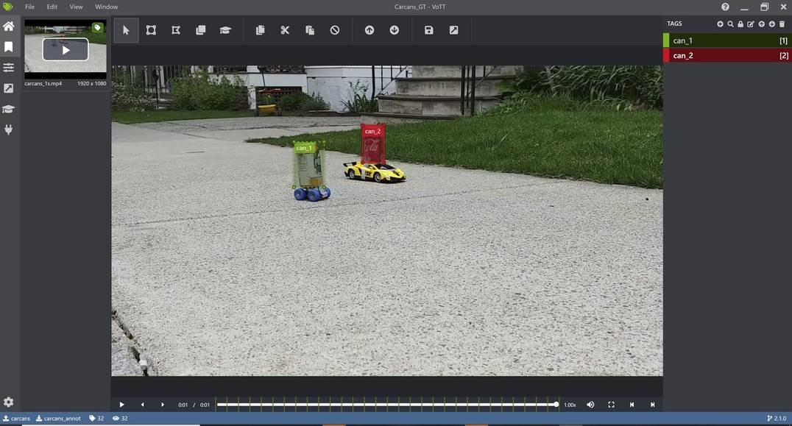
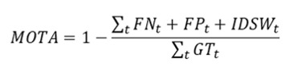
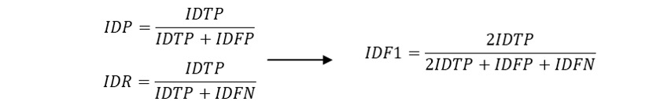
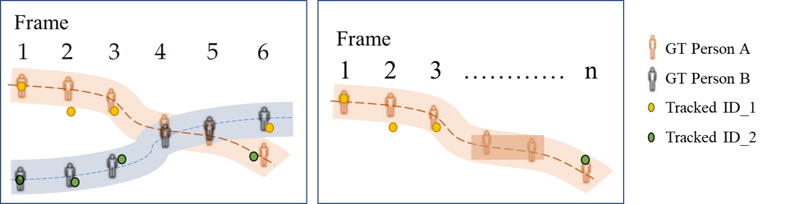
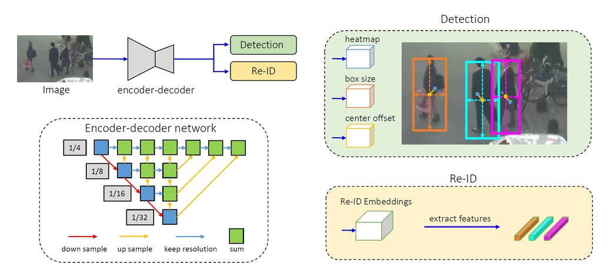
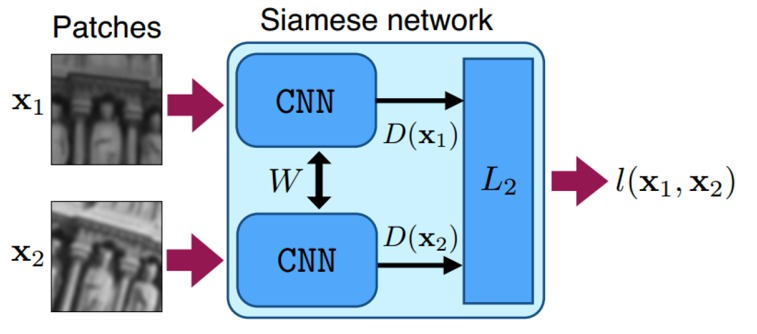
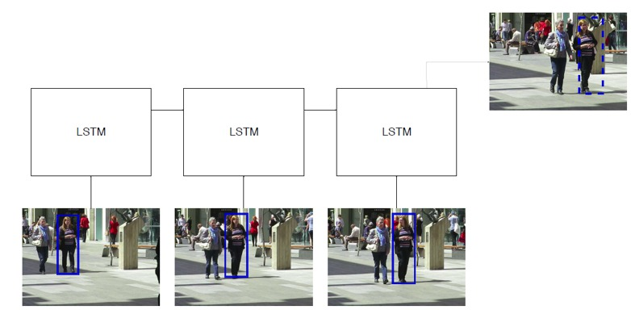
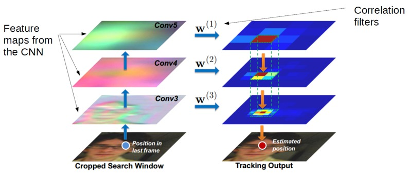
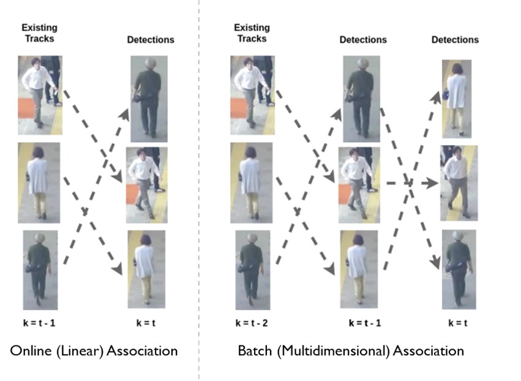

# Multi-Object Tracking

## Frequently asked questions

This document includes answers and information relating to common questions and topics regarding multi-object tracking. For more general Machine Learning questions, such as "How many training examples do I need?" or "How to monitor GPU usage during training?", see also the image classification [FAQ](https://github.com/microsoft/ComputerVision/blob/master/classification/FAQ.md).

* Data  
  * [How to annotate images?](#how-to-annotate-images)

* Training and Inference
  * [What are the training losses in FairMOT?](#what-are-the-training-losses-in-fairmot)
  * [What are the main inference parameters in FairMOT?](#what-are-the-main-inference-parameters-in-fairmot)

* Evaluation
  * [What is the MOT Challenge?](#what-is-the-mot-challenge)
  * [What are the commonly used evaluation metrics?](#what-are-the-commonly-used-evaluation-metrics)

* State-of-the-Art(SoTA) Technology
  * [Popular MOT datasets](#popular-mot-datasets)
  * [What is the architecture of the FairMOT tracking algorithm?](#what-is-the-architecture-of-the-fairmot-tracking-algorithm)
  * [What object detectors are used in tracking-by-detection trackers?](#what-object-detectors-are-used-in-tracking-by-detection-trackers)
  * [What feature extraction techniques are used in tracking-by-detection trackers?](#what-feature-extraction-techniques-are-used-in-tracking-by-detection-trackers)
  * [What affinity and association techniques are used in tracking-by-detection trackers?](#what-affinity-and-association-techniques-are-used-in-tracking-by-detection-trackers)
  * [What is the difference between online and offline (batch) tracking algorithms?](#what-is-the-difference-between-online-and-offline-tracking-algorithms)

* [Popular Publications and Datasets]
  * [Popular Datasets](#popular-datasets)
  * [Popular Publications](#popular-publications)


## Data

### How to annotate images?

For training we use the exact same annotation format as for object detection (see this [FAQ](https://github.com/microsoft/computervision-recipes/blob/master/scenarios/detection/FAQ.md#how-to-annotate-images)). This also means that we train from individual frames, without taking temporal location of these frames into account.

For evaluation, we follow the [py-motmetrics](https://github.com/cheind/py-motmetrics) repository which requires the ground-truth data to be in [MOT challenge](https://motchallenge.net/) format. The last 3 columns can be set to -1 by default, for the purpose of ground-truth annotation:
```
[frame number] [id number] [bbox left] [bbox top] [bbox width] [bbox height][confidence score][class][visibility]
```


See below an example where we use [VOTT](#https://github.com/microsoft/VoTT) to annotate the two cans in the image as `can_1` and `can_2` where `can_1` refers to the white/yellow can and `can_2` refers to the red can. Before annotating, it is important to correctly set the extraction rate to match that of the video. After annotation, you can export the annotation results into several forms, such as PASCAL VOC or .csv form. For the .csv format, VOTT would return the extracted frames, as well as a csv file containing the bounding box and id info:
```
[image] [xmin] [y_min] [x_max] [y_max] [label]
```

<p align="center">

</p>

Under the hood (not exposed to the user) the FairMOT repository uses this annotation format for training where each line describes a bounding box as follows, as described in the [Towards-Realtime-MOT](https://github.com/Zhongdao/Towards-Realtime-MOT) repository:
```
[class] [identity] [x_center] [y_center] [width] [height]
```

The `class` field is set to 0, for all, as only single-class multi-object tracking is currently supported by the FairMOT repo (e.g. cans). The field identity is an integer from 0 to num_identities - 1 which maps class names to integers (e.g. coke can, coffee can, etc). The values of [x_center] [y_center] [width] [height] are normalized by the width/height of the image, and range from 0 to 1.


## Training and inference

### What are the training losses in FairMOT?

Losses generated by FairMOT include detection-specific losses (e.g. hm_loss, wh_loss, off_loss) and id-specific losses (id_loss). The overall loss (loss) is a weighted average of the detection-specific and id-specific losses, see the [FairMOT paper](https://arxiv.org/pdf/2004.01888v2.pdf).

### What are the main inference parameters in FairMOT?

- input_w and input_h: image resolution of the dataset video frames
- conf_thres, nms_thres, min_box_area: these thresholds used to filter out detections that do not meet the confidence level, nms level and size as per the user requirement;
- track_buffer: if a lost track is not matched for some number of frames as determined by this threshold, it is deleted, i.e. the id is not reused.


## Evaluation

### What is the MOT Challenge?
The [MOT Challenge](#https://motchallenge.net/) website hosts the most common benchmarking datasets for pedestrian MOT. Different datasets exist: MOT15, MOT16/17, MOT 19/20. These datasets contain many video sequences, with different tracking difficulty levels, with annotated ground-truth. Detections are also provided for optional use by the participating tracking algorithms.


### What are the commonly used evaluation metrics?
As multi-object-tracking is a complex CV task, there exists many different metrics to evaluate the tracking performance. Based on how they are computed, metrics can be event-based [CLEARMOT metrics](https://link.springer.com/content/pdf/10.1155/2008/246309.pdf) or [id-based metrics](https://arxiv.org/pdf/1609.01775.pdf). The main metrics used to gauge performance in the [MOT benchmarking challenge](https://motchallenge.net/results/MOT16/) include MOTA, IDF1, and ID-switch.

* MOTA (Multiple Object Tracking Accuracy) gauges overall accuracy performance using an event-based computation of how often mismatch occurs between the tracking results and ground-truth. MOTA contains the counts of FP (false-positive), FN (false negative), and id-switches (IDSW) normalized over the total number of ground-truth (GT) tracks.

<p align="center">

</p>

* IDF1 measures overall performance with id-based computation of how long the tracker correctly identifies the target. It is the harmonic mean of identification precision (IDP) and recall (IDR).

<p align="center">

</p>

* ID-switch measures when the tracker incorrectly changes the ID of a trajectory. This is illustrated in the following figure: in the left box, person A and person B overlap and are not detected and tracked in frames 4-5. This results in an id-switch in frame 6, where person A is attributed the ID_2, which was previously tagged as person B. In another example in the right box, the tracker loses track of person A (initially identified as ID_1) after frame 3, and eventually identifies that person with a new ID (ID_2) in frame n, showing another instance of id-switch.

<p align="center">

</p>


## State-of-the-Art

### What is the architecture of the FairMOT tracking algorithm?
It consists of a single encoder-decoder neural network that extracts high resolution feature maps of the image frame. As a one-shot tracker, it feeds into two parallel heads for predicting bounding boxes and re-id features respectively, see [source](https://arxiv.org/pdf/2004.01888v2.pdf):
<p align="center">

</p>

<center>

Source: [Zhang, 2020](https://arxiv.org/pdf/2004.01888v2.pdf)

</center>


### What object detectors are used in tracking-by-detection trackers?
The most popular object detectors used by SoTA tacking algorithms include: [Faster R-CNN](https://arxiv.org/pdf/1506.01497.pdf), [SSD](https://arxiv.org/pdf/1512.02325.pdf) and [YOLOv3](https://arxiv.org/pdf/1804.02767.pdf). Please see our [object detection FAQ page](../detection/faq.md) for more details.  


### What feature extraction techniques are used in tracking-by-detection trackers?
While older algorithms used local features, such as optical flow or regional features (e.g. color histograms, gradient-based features or covariance matrix), newer algorithms have deep-learning based feature representations. The most common deep-learning approaches, typically trained on re-id datasets, use classical CNNs to extract visual features. One such dataset is the [MARS dataset](http://www.liangzheng.com.cn/Project/project_mars.html). The following figure is an example of a CNN used for MOT by the [DeepSORT tracker](https://arxiv.org/pdf/1703.07402.pdf):
        <p align="center">
        
        </p>
Newer deep-learning approaches include Siamese CNN networks, LSTM networks, or CNN with correlation filters. In Siamese CNN networks, a pair of identical CNN networks are used to measure similarity between two objects, and the CNNs are trained with loss functions that learn features that best differentiate them.
             <p align="center">
            
            </p>
<center>

 Source: [(Simon-Serra et al, 2015)](https://www.cv-foundation.org/openaccess/content_iccv_2015/papers/Simo-Serra_Discriminative_Learning_of_ICCV_2015_paper.pdf)

</center>

In an LSTM network, extracted features from different detections in different time frames are used as inputs. The network predicts the bounding box for the next frame based on the input history.
             <p align="center">
            
            </p>
<center>

Source: [Ciaparrone, 2019](https://arxiv.org/pdf/1907.12740.pdf)

</center>

Correlation filters can also be convolved with feature maps from CNN network to generate a prediction of the target's location in the next time frame. This was done by [Ma et al](https://faculty.ucmerced.edu/mhyang/papers/iccv15_tracking.pdf) as follows:
            <p align="center">
            
            </p>


### What affinity and association techniques are used in tracking-by-detection trackers?
Simple approaches use similarity/affinity scores calculated from distance measures over features extracted by the CNN to optimally match object detections/tracklets with established object tracks across successive frames. To do this matching, Hungarian (Huhn-Munkres) algorithm is often used for online data association, while K-partite graph global optimization techniques are used for offline data association.

In more complex deep-learning approaches, the affinity computation is often merged with feature extraction. For instance, [Siamese CNNs](https://arxiv.org/pdf/1907.12740.pdf) and [Siamese LSTMs](http://openaccess.thecvf.com/content_cvpr_2018_workshops/papers/w21/Wan_An_Online_and_CVPR_2018_paper.pdf) directly output the affinity score.


### What is the difference between online and offline tracking algorithms?
Online and offline algorithms differ at their data association step. In online tracking, the detections in a new frame are associated with tracks generated previously from previous frames. Thus, existing tracks are extended or new tracks are created. In offline (batch) tracking, all observations in a batch of frames can be considered globally (see figure below), i.e. they are linked together into tracks by obtaining a global optimal solution. Offline tracking can perform better with tracking issues such as long-term occlusion, or similar targets that are spatially close. However, offline tracking tends to be slower and hence not suitable for tasks which require real-time processing such as autonomous driving.

<p align="center">

</p>


## Popular publications and datasets

### Popular Datasets

<center>

| Name  | Year  | Duration |	# tracks/ids | Scene | Object type |
| ----- | ----- | -------- | --------------  | ----- |  ---------- |
| [MOT15](https://arxiv.org/pdf/1504.01942.pdf)| 2015 | 16 min | 1221 | Outdoor | Pedestrians |
| [MOT16/17](https://arxiv.org/pdf/1603.00831.pdf)| 2016 | 9 min | 1276 | Outdoor & indoor | Pedestrians & vehicles |
| [CVPR19/MOT20](https://arxiv.org/pdf/1906.04567.pdf)| 2019 | 26 min | 3833 | Crowded scenes | Pedestrians & vehicles |
| [PathTrack](http://openaccess.thecvf.com/content_ICCV_2017/papers/Manen_PathTrack_Fast_Trajectory_ICCV_2017_paper.pdf)| 2017 | 172 min | 16287 | YouTube people scenes | Persons |
| [Visdrone](https://arxiv.org/pdf/1804.07437.pdf)| 2019 | - | - | Outdoor view from drone camera | Pedestrians & vehicles |
| [KITTI](http://www.jimmyren.com/papers/rrc_kitti.pdf)| 2012 | 32 min | - | Traffic scenes from car camera | Pedestrians & vehicles |
| [UA-DETRAC](https://arxiv.org/pdf/1511.04136.pdf) | 2015 | 10h | 8200 | Traffic scenes | Vehicles |
| [CamNeT](https://vcg.ece.ucr.edu/sites/g/files/rcwecm2661/files/2019-02/egpaper_final.pdf) | 2015 | 30 min | 30 | Outdoor & indoor | Persons |

</center>


### Popular publications

<center>

| Name | Year | MOT16 IDF1 | MOT16 MOTA | Inference Speed(fps) | Online/ Batch | Detector |  Feature extraction/ motion model | Affinity & Association Approach |
| ---- | ---- | ---------- | ---------- | -------------------- | ------------- | -------- | -------------------------------- | -------------------- |
|[A Simple Baseline for Multi-object Tracking -FairMOT](https://arxiv.org/pdf/2004.01888.pdf)|2020|70.4|68.7|25.8|Online|One-shot tracker with detector head|One-shot tracker with re-id head & multi-layer feature aggregation, IOU, Kalman Filter| JV algorithm on IOU, embedding distance,
|[How to Train Your Deep Multi-Object Tracker -DeepMOT-Tracktor](https://arxiv.org/pdf/1906.06618v2.pdf)|2020|53.4|54.8|1.6|Online|Single object tracker: Faster-RCNN (Tracktor), GO-TURN, SiamRPN|Tracktor, CNN re-id module|Deep Hungarian Net using Bi-RNN|
|[Tracking without bells and whistles -Tracktor](https://arxiv.org/pdf/1903.05625.pdf)|2019|54.9|56.2|1.6|Online|Modified Faster-RCNN| Temporal bbox regression with bbox camera motion compensation, re-id embedding from Siamese CNN| Greedy heuristic to merge tracklets using re-id embedding distance|
|[Towards Real-Time Multi-Object Tracking -JDE](https://arxiv.org/pdf/1909.12605v1.pdf)|2019|55.8|64.4|18.5|Online|One-shot tracker - Faster R-CNN with FPN|One-shot - Faster R-CNN with FPN, Kalman Filter|Hungarian Algorithm|
|[Exploit the connectivity: Multi-object tracking with TrackletNet -TNT](https://arxiv.org/pdf/1811.07258.pdf)|2019|56.1|49.2|0.7|Batch|MOT challenge detections|CNN with bbox camera motion compensation, embedding feature similarity|CNN-based similarity measures between tracklet pairs; tracklet-based graph-cut optimization|
|[Extending IOU based Multi-Object Tracking by Visual Information -VIOU](http://elvera.nue.tu-berlin.de/typo3/files/1547Bochinski2018.pdf)|2018|56.1(VisDrone)|40.2(VisDrone)|20(VisDrone)|Batch|Mask R-CNN, CompACT|IOU|KCF to merge tracklets using greedy IOU heuristics|
|[Simple Online and Realtime Tracking with a Deep Association Metric -DeepSORT](https://arxiv.org/pdf/1703.07402v1.pdf)|2017|62.2| 61.4|17.4|Online|Modified Faster R-CNN|CNN re-id module, IOU, Kalman Filter|Hungarian Algorithm, cascaded approach using Mahalanobis distance (motion), embedding distance |
|[Multiple people tracking by lifted multicut and person re-identification -LMP](http://openaccess.thecvf.com/content_cvpr_2017/papers/Tang_Multiple_People_Tracking_CVPR_2017_paper.pdf)|2017|51.3|48.8|0.5|Batch|[Public detections](https://arxiv.org/pdf/1610.06136.pdf)|StackeNetPose CNN re-id module|Spatio-temporal relations, deep-matching, re-id confidence; detection-based graph lifted-multicut optimization|

</center>
