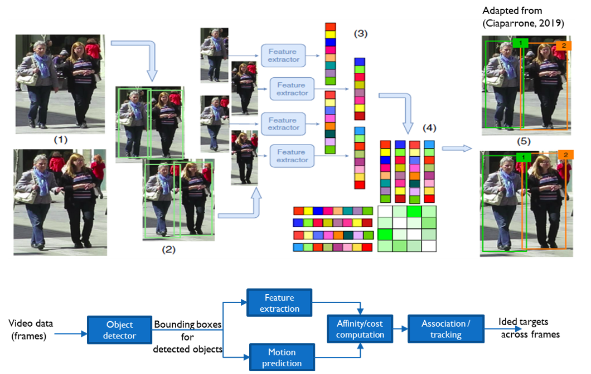
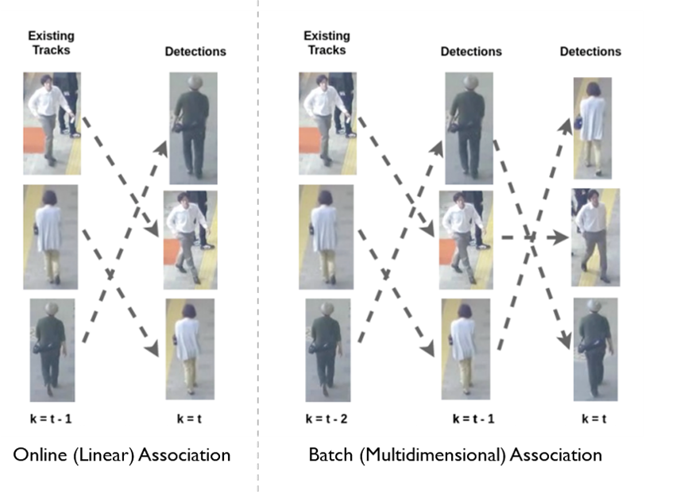
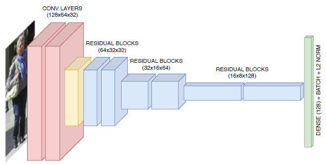
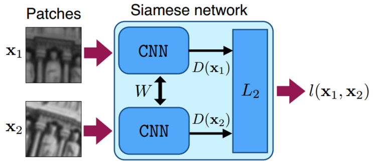
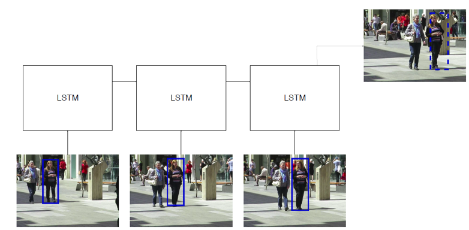
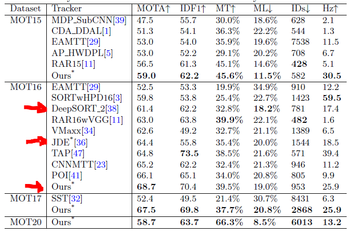
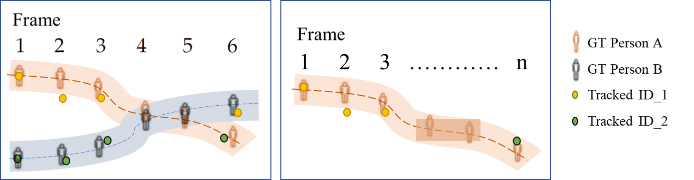
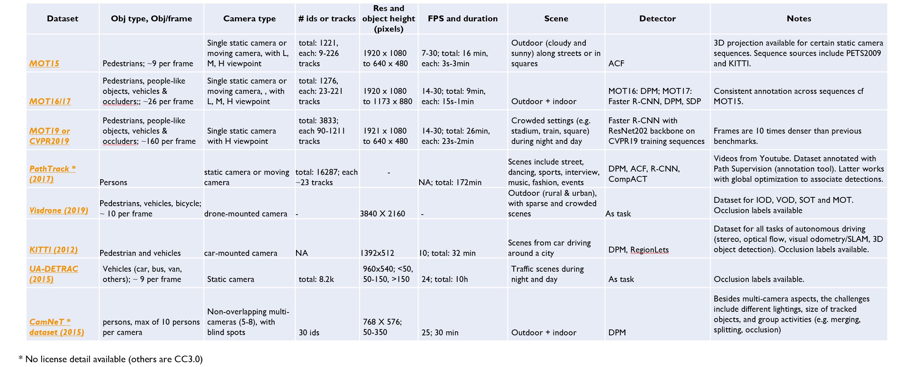
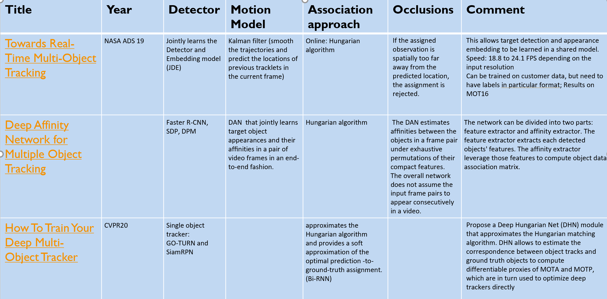
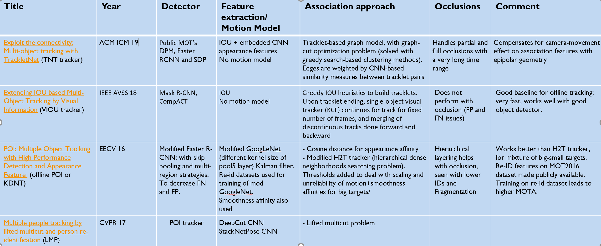

# Multi-Object Tracking

```diff
+ June 2020: This work is ongoing.
```

This directory provides examples and best practices for building multi-object tracking systems. Our goal is to enable the users to bring their own datasets and train a high-accuracy model easily. 

## Technology
Multi-object-tracking (MOT) is one of the hot research topics in Computer Vision, due to its wide applications in autonomous driving, traffic surveillance, etc. It builds on object detection technology, in order to detect and track all objects in a dynamic scene over time, without any prior knowledge about the appearance and number of target objects. Inferring target trajectories correctly across successive image frames remains challenging: occlusion happens when objects overlap; the number of and appearance of objects can change. Compared to object detection algorithms, which aim to output rectangular bounding boxes around the objects, MOT algorithms additionally associated an ID number to each box to identify that specific object across the image frames. 

As seen in the figure below ([Ciaparrone, 2019](https://arxiv.org/pdf/1907.12740.pdf)), a typical multi-object-tracking algorithm performs part or all of the following steps:
* Detection: Given the input raw image frames (step 1), the detector identifies object(s) on each image frame as bounding box(es) (step 2).
* Feature extraction/motion prediction: For every detected object, visual appearance and motion features are extracted (step 3). Sometimes, a motion predictor (e.g. Kalman Filter) is also added to predict the next position of each tracked target. 
* Affinity: The feature and motion predictions are used to calculate similarity/distance scores between pairs of detections and/or tracklets, or the probabilities of detections belonging to a given target or tracklet (step 4). 
* Association: Based on these scores/probabilities, a specific numerical ID is assigned to each detected object as it is tracked across successive image frames (step 5).

<p align="center">

</p> 


**Online vs offline(batch tracking)**   

In general, MOT algorithms can be divided into online tracking and offline tracking, which differ at the data association step. In online tracking, only the observations up to the current frame are taken into consideration when processing a new frame: typically, the new detections in the new frame are associated with tracks generated previously from the previous frame (see figure below), thus existing tracks are extended or new tracks are created. In offline tracking, all observations in a batch of frames are considered globally (see figure below), in that they are linked together into tracks by obtaining a global optimal solution. In this way, offline tracking can perform better with tracking issues such as long-term occlusion, or similar targets that are spatially close. However, offline tracking is slow not suitable for online tasks, such as for autonomous driving. Recently, research has focused on online tracking algorithms, which have reached the performance of offline-tracking, while still maintaining high inference speed. 

<p align="center">

</p>


## State-of-the-art (SoTA)

### Typical MOT modules 
SoTA tracking algorithms differ in terms of the techniques used in the MOT modules, i.e. detection, feature extraction & motion prediction, affinity and association. Some of the most recent techniques are as follows:
* Detection:
    * The most popular object detectors used by SoTA tacking algorithms include: [Faster R-CNN](https://arxiv.org/pdf/1506.01497.pdf), [SSD](https://arxiv.org/pdf/1512.02325.pdf) and [YOLOv3](https://arxiv.org/pdf/1804.02767.pdf). Please see our [object detection FAQ page](../detection/faq.md) for more details.  

* Feature extraction & motion prediction:
    * Older algorithms used local features such as optical flow or regional features such as color histograms, gradient-based features or covariance matrix.
    * Newer algorithms have a deep-learning based feature representation, with optionally, a Kalman Filter for motion prediction. 
    * The most common deep-learning approaches use classical CNN to extract visual features, typically trained on re-id datasets, such as the [MARS dataset](http://www.liangzheng.com.cn/Project/project_mars.html). The following figure is an example of a CNN used for MOT by the [DeepSORT tracker](https://arxiv.org/pdf/1703.07402.pdf):
        <p align="center">
        
        </p>
    * Newer deep-learning approaches include Siamese CNN networks, LSTM networks, or CNN with correlation filters. 
        * In Siamese CNN networks, a pair of CNN networks is used to measure similarity between two objects, and the CNNs are trained with loss functions that learn features that best differentiates them. #TODO: @Liqun,source of images
             <p align="center">
            
            </p>
        * In LSTM network, extracted features from different detections in different time frames are used as inputs to a LSTM network, which predicts the bounding box for the next frame based on the input history.
             <p align="center">
            
            </p>
        * Correlation filters can also be convolved with feature maps from CNN network to generate a prediction of the target's location in the next time frame. This was done by [Ma et al](https://faculty.ucmerced.edu/mhyang/papers/iccv15_tracking.pdf) as follows:
            <p align="center">
            
            </p>
   
* Affinity & association:
    * Simple approaches use similarity/affinity scores calculated from distance measures over features extracted by the CNN to optimally match object detections/tracklets with established object tracks across successive frames. To do this matching,  Hungarian (Huhn-Munkres) algorithm is often used for online data association, while K-partite graph global optimization techniques are used for offline data association. 
    * In more complex deep-learning approaches, the affinity computation is often merged with feature extraction. For instance, [Siamese CNNs] (#TODO add ref, @Liqun) and [Siamese LSTMs](http://openaccess.thecvf.com/content_cvpr_2018_workshops/papers/w21/Wan_An_Online_and_CVPR_2018_paper.pdf) directly output the affinity score.

### Tracking-by-detection (two-step) vs one-shot tracker  

Typical tracking algorithms address the detection and feature extraction processes in distinct successive steps, with different techniques used for the different steps, as described above. Recent research -[(Voigtlaender et al, 2019)](http://openaccess.thecvf.com/content_CVPR_2019/papers/Voigtlaender_MOTS_Multi-Object_Tracking_and_Segmentation_CVPR_2019_paper.pdf), [(Wang et al, 2019)](https://arxiv.org/pdf/1909.12605.pdf), [(Zhang et al, 2020)](https://arxiv.org/pdf/1909.12605.pdf)- has moved onto combining the detection and feature embedding processes such that they are learned in a shared model (single network), particularly when both steps involving deep learning models. This framework is called single-shot or one-shot, and recent models include FairMOT  [(Zhang et al, 2020)](https://arxiv.org/pdf/1909.12605.pdf), JDE [(Wang et al, 2019)](https://arxiv.org/pdf/1909.12605.pdf) and TrackRCNN [(Voigtlaender et al, 2019)](http://openaccess.thecvf.com/content_CVPR_2019/papers/Voigtlaender_MOTS_Multi-Object_Tracking_and_Segmentation_CVPR_2019_paper.pdf). Such single-shot models are more efficient than typical tracking-by-detection models and have shown faster inference speeds as the detection and feature embedding is done through shared computation of the single network representation: on the [MOT16 Challenge dataset](https://motchallenge.net/results/MOT16/), FAIRMOT and JDE achieve 30 fps and 18.5 fps respectively, while DeepSORT_2, a tracking-by-detection tracker with lower performance achieves 17.4 fps.

 While the JDE model does not improve tracking performance, the FairMOT model does: as seen in the table below, JDE has a much worse ID-switch number [(Zhang et al, 2020)](https://arxiv.org/pdf/1909.12605.pdf). This is because the FairMOT model uses a typical anchor-based object detector network for feature embedding with a downsampled feature map, leading to a mis-alignment between the anchors and object center, hence re-iding issues. FairMOT solves these issues by: (i) estimating the object center instead of the anchors and using a higher resolution feature map for object detection and feature embedding, (ii) aggregating high-level and low-level features to handle scale variations across different sizes of objects.

<p align="center">

</p>

### Evaluation metrics
As multi-object-tracking is a complex CV task, there exists many different metrics to evaluate the tracking performance.  Based on how they are computed, metrics can be event-based [CLEARMOT metrics](https://link.springer.com/content/pdf/10.1155/2008/246309.pdf) or [id-based metrics](https://arxiv.org/pdf/1609.01775.pdf). The main metrics used to gauge performance in the [MOT benchmarking challenge](https://motchallenge.net/results/MOT16/) include MOTA, IDF1, and ID-switch.
* MOTA (Multiple Object Tracking Accuracy): it gauges overall accuracy performance, with event-based computation of how often mismatch occurs between the tracking results and ground-truth. MOTA contains the counts of FP (false-positive), FN(false negative) and id-switches (IDSW), normalized over the total number of ground-truth (GT) tracks.
<p align="center">

</p>

* IDF1: gauges overall performance, with id-based computation of how long the tracker correctly identifies the target. It is the harmonic mean of identification precision (IDP) and recall (IDR): 
<p align="center">

</p>

* ID-switch: when the tracker incorrectly changes the ID of the trajectory. This is illustrated in the following figure: in the left box, person A and person B overlap and are not detected and tracked in frames 4-5, resulting in an id-switch in frame 6, where person A is attributed the ID_2, which previously tagged person B. In another example in the right box, the tracker lost track of person A (initially identified as ID_1) after frame 3, and eventually identified that person with a new ID (ID_2) in frame n, showing another instance of id-switch. 

<p align="center">

</p>


### Popular datasets
<p align="center">

</p>

### Popular publications
* General overview #TODO
* Benchmarking #TODO
* Seminal/baseline method papers #TODO
* Recent online & offline trackers, see table below #TODO: publication lists + deep-dive comments, check with @Liqun

<p align="center">

</p>

<p align="center">

</p>

## Notebooks

We provide several notebooks to show how multi-object-tracking algorithms can be designed and evaluated:

| Notebook name | Description |
| --- | --- |
| [00_webcam.ipynb](./00_webcam.ipynb)| Quick-start notebook which demonstrates how to build an object tracking system using a single video or webcam as input.
| [01_training_introduction.ipynb](./01_training_introduction.ipynb)| Notebook which explains the basic concepts around model training, inferencing, and evaluation using typical tracking performance metrics.|
| [02_mot_challenge.ipynb](./02_mot_challenge.ipynb) | Notebook which runs inference on a large dataset, the MOT challenge XX dataset. |


## Frequently asked questions

Answers to frequently asked questions such as "How does the technology work?", "What data formats are required?" can be found in the [FAQ](FAQ.md) located in this folder. For generic questions such as "How many training examples do I need?" or "How to monitor GPU usage during training?" see the [FAQ.md](../classification/FAQ.md) in the classification folder.


## Contribution guidelines

See the [contribution guidelines](../../CONTRIBUTING.md) in the root folder.
