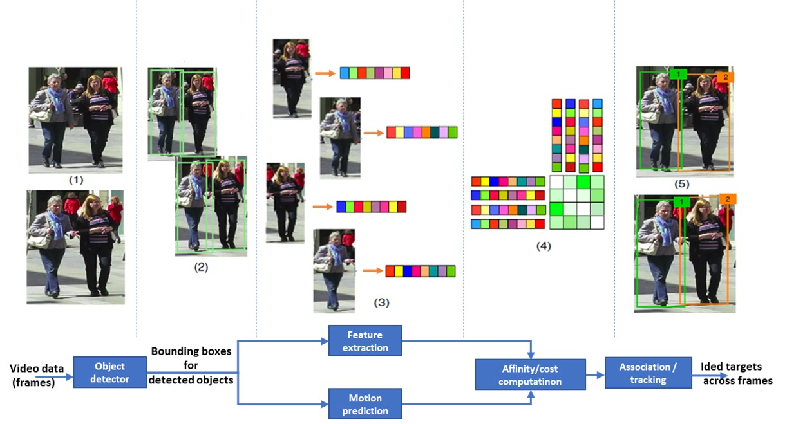

# Multi-Object Tracking

This directory provides examples and best practices for building and inferencing multi-object tracking systems. Our goal is to enable users to bring their own datasets and to train a high-accuracy tracking model with ease. While there are many open-source trackers available, we have integrated the [FairMOT](https://github.com/ifzhang/FairMOT) tracker to this repository. The FairMOT algorithm has shown competitive tracking performance in recent MOT benchmarking challenges, while also having respectable inference speeds.


## Setup

The tracking examples in this folder only run on Linux compute targets due to constraints introduced by the [FairMOT](https://github.com/ifzhang/FairMOT) repository.

The following libraries need to be installed in the `cv` conda environment before being able to run the provided notebooks:
```
activate cv
conda install -c conda-forge opencv yacs lap progress
pip install cython_bbox motmetrics
```

In addition, FairMOT's DCNv2 library needs to be compiled using this step:
```
cd utils_cv/tracking/references/fairmot/models/networks/DCNv2  
sh make.sh
```


## Why FairMOT?
FairMOT is an [open-source](https://github.com/ifzhang/FairMOT), one-shot online tracking algorithm that has shown [competitive performance in recent MOT benchmarking challenges](https://motchallenge.net/method/MOT=3015&chl=5) at fast inferencing speeds.

Typical tracking algorithms address the detection and feature extraction processes in distinct successive steps. Recent research -[(Voigtlaender et al, 2019)](http://openaccess.thecvf.com/content_CVPR_2019/papers/Voigtlaender_MOTS_Multi-Object_Tracking_and_Segmentation_CVPR_2019_paper.pdf), [(Wang et al, 2019)](https://arxiv.org/pdf/1909.12605.pdf), [(Zhang et al, 2020)](https://arxiv.org/pdf/1909.12605.pdf)- has moved onto combining the detection and feature embedding processes such that they are learned in a shared model (single network), particularly when both steps involving deep learning models. This framework is called single-shot or one-shot, and has become popular in recent, high-performing models, such as FairMOT [(Zhang et al, 2020)](https://arxiv.org/pdf/1909.12605.pdf), JDE [(Wang et al, 2019)](https://arxiv.org/pdf/1909.12605.pdf) and TrackRCNN [(Voigtlaender et al, 2019)](http://openaccess.thecvf.com/content_CVPR_2019/papers/Voigtlaender_MOTS_Multi-Object_Tracking_and_Segmentation_CVPR_2019_paper.pdf). Such single-shot models are more efficient than typical tracking-by-detection models and have shown faster inference speeds due to the shared computation of the single network representation of the detection and feature embedding. On the [MOT16 Challenge dataset](https://motchallenge.net/results/MOT16/), FAIRMOT and JDE achieve 25.8 frames per seconds (fps) and 18.5 fps respectively, while DeepSORT_2, a tracking-by-detection tracker, achieves 17.4 fps.

As seen in the table below, the FairMOT model has improved tracking performance when compared to standard MOT trackers (please see the [below](#What-are-the-commonly-used-evaluation-metrics) for more details on performance metrics). The JDE model, which FairMOT builds off, has a much worse ID-switch number [(Zhang et al, 2020)](https://arxiv.org/pdf/1909.12605.pdf). The JDE model uses a typical anchor-based object detector network for feature embedding with a down sampled feature map. This leads to a misalignment between the anchors and the object center, therefore causing re-iding issues. FairMOT solves these issues by estimating the object center instead of the anchors, using a higher resolution feature map for object detection and feature embedding, and by aggregating high-level and low-level features to handle scale variations across different sizes of objects.

<center>

| Tracker  | MOTA | IDF1 |	ID-Switch | fps |
| -------- | ---- | ---- | ---------  | --- |
|DeepSORT_2| 61.4 | 62.2 | 781 | 17.4 |
|JDE| 64.4 | 55.8 | 1544 | 18.5 |
|FairMOT| 68.7 | 70.4 | 953 | 25.8 |

</center>


## Technology
Due to its applications in autonomous driving, traffic surveillance, etc., multi-object-tracking (MOT) is a popular and growing area of reseach within Computer Vision. MOT builds on object detection technology to detect and track objects in a dynamic scene over time. Inferring target trajectories correctly across successive image frames remains challenging. For example, occlusion can cause the number and appearance of objects to change, resulting in complications for MOT algorithms. Compared to object detection algorithms, which aim to output rectangular bounding boxes around the objects, MOT algorithms additionally associated an ID number to each box to identify that specific object across the image frames.

As seen in the figure below ([Ciaparrone, 2019](https://arxiv.org/pdf/1907.12740.pdf)), a typical multi-object-tracking algorithm performs part or all of the following steps:
* Detection: Given the input raw image frames (step 1), the detector identifies object(s) in each image frame as bounding box(es) (step 2).
* Feature extraction/motion prediction: For every detected object, visual appearance and motion features are extracted (step 3). A motion predictor (e.g. Kalman Filter) is occasionally also added to predict the next position of each tracked target.
* Affinity: The feature and motion predictions are used to calculate similarity/distance scores between pairs of detections and/or tracklets, or the probabilities of detections belonging to a given target or tracklet (step 4).
* Association: Based on these scores/probabilities, a specific numerical ID is assigned to each detected object as it is tracked across successive image frames (step 5).

<p align="center">

</p>


## Notebooks

We provide several notebooks to show how multi-object-tracking algorithms can be designed and evaluated:

| Notebook name | Description |
| --- | --- |
| [01_training_introduction.ipynb](./01_training_introduction.ipynb)| Notebook that explains the basic concepts around model training, inferencing, and evaluation using typical tracking performance metrics.|
| [02_mot_challenge.ipynb](./02_mot_challenge.ipynb) | Notebook that runs model inference on the commonly used MOT Challenge dataset. |


## Frequently Asked Questions

Answers to frequently asked questions, such as "How does the technology work?" or "What data formats are required?", can be found in the [FAQ](FAQ.md) located in this folder. For generic questions, such as "How many training examples do I need?" or "How to monitor GPU usage during training?", see the [FAQ.md](../classification/FAQ.md) in the classification folder.

## Contribution Guidelines

See the [contribution guidelines](../../CONTRIBUTING.md) in the root folder.
