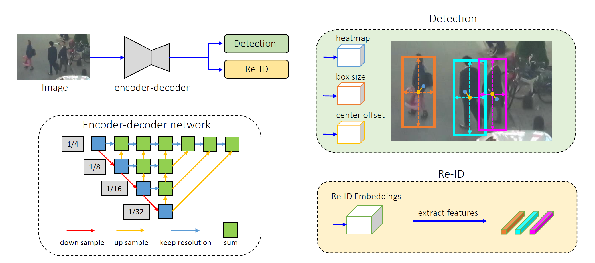

# Multi-Object Tracking

## Frequently asked questions

This document tries to answer frequent questions related to multi-object tracking. For generic Machine Learning questions, such as "How many training examples do I need?" or "How to monitor GPU usage during training?" see also the image classification [FAQ](https://github.com/microsoft/ComputerVision/blob/master/classification/FAQ.md).

* General
  * [Why FairMOT repository for the tracking algorithm?](#why-FAIRMOT)
  * [What are additional complexities that can be enahnce the current multi-object tracking algorithm](#)

* Data
  * [How to annotate training data?](#how-to-annotate-training-data)
  * [How to annotate a video for evaluation?](#how-to-annotate-a-video-for-evaluation)]
  * [What is the MOT Challenge format used by the evaluation package?](#)

* Technology
  * [What is the architecture of the FairMOT tracking algorithm?]() 
  * [What are the evaluation metrics about?](#)

* Training and Inference
  * [How to improve accuracy?](#how-to-improve-accuracy)
  * [What are the main training parameters in FairMOT?](# )
  * [What are the main inference parameters in FairMOT?](# )
  * [What are the training losses for MOT using FairMOT?](# )

* MOT Challenge
  * [What is the MOT Challenge?](# )


## General

### Why FairMOT?
FairMOT has shown the best performance in recent MOT benchmarking challenges. 

### What are additional complexities that can be enhance the current multi-object tracking algorithm?
* Multi-camera processing 
* Compensation for camera-movement effect on association features with epipolar geometry

## Data

### How to annotate training data?
xml format?? Pascal VOC in VOTT??

### How to annotate a video for evaluation?
We can use an annotation tool, such as VOTT, to annotate a video for ground-truth. For example, for the evaluation video, we can draw bounding boxes around the 2 cans, and tag them as `can_1` and `can_2`: 
<p align="center">

</p>

Before annotating, make sure to set the extraction rate to 30fps, to match that of the video. After annotation, you can export the annotation results into csv form. You will end up with the extracted frames as well as a csv file containing the bounding box and id info: ``` [image] [xmin] [y_min] [x_max] [y_max] [label]```

### What is the MOT Challenge format used by the evaluation package?
The evaluation package, from  the [py-motmetrics](https://github.com/cheind/py-motmetrics) repository, requires the ground-truth data to be in [MOT challenge](https://motchallenge.net/) format, i.e.: 
```
[frame number] [id number] [bbox left] [bbox top] [bbox width] [bbox height][confidence score][class][visibility]
```
The last 3 columns can be set to -1 by default, for the purpose of ground-truth annotation.


## Technology


### What is the architecture of the FairMOT tracking algorithm?
<p align="center">

</p>


### What are the evaluation metrics about?


## Training and inference

### How to improve accuracy?

### What are the main training parameters in FairMOT?
FairMOT uses Torch's Adam algorithm as the default optimizer.
* Learning rate
* Batch size

### What are the training losses for MOT using FairMOT?
Losses generated by the FairMOT include detection-specific losses (e.g. hm_loss, wh_loss, off_loss) and id-specific losses (id_loss). The overall loss (loss) is a weighted average of the detection-specific and id-specific losses, see the [FairMOT paper](https://arxiv.org/pdf/2004.01888v2.pdf). 

### What are the main inference parameters in FairMOT?
- input_w and input_h: image resolution of the dataset video frames, lower resolution increases inference speed at some expense of performance
- conf_thres, nms_thres, min_box_area: thresholds used to filter out detections that do not meet the confidence level, nms level and size as per the user requirement
- track_buffer: if a lost track is not matched for some number of frames as determined by this threshold, it is deleted, i.e. the id is not reused.

## MOT Challenge

### What is the MOT Challenge?
It hosts the most common benchmarking datasets for pedestrian MOT. Different datasets exist: MOT15, MOT16/17, MOT 19/20. These datasets contain many video sequences, with different tracking difficulty levels, with annotated ground-truth. 
